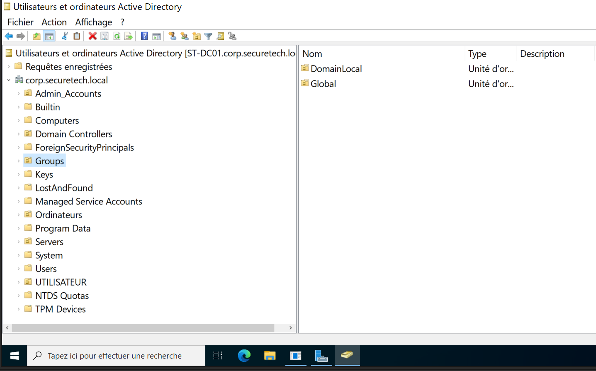
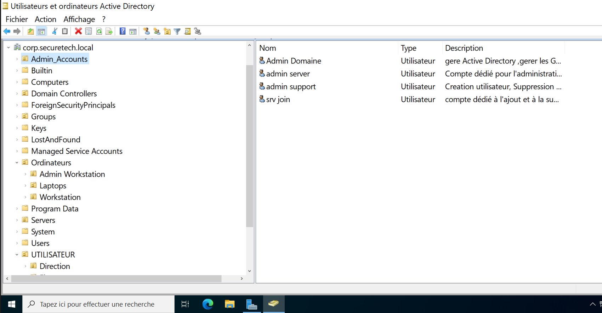
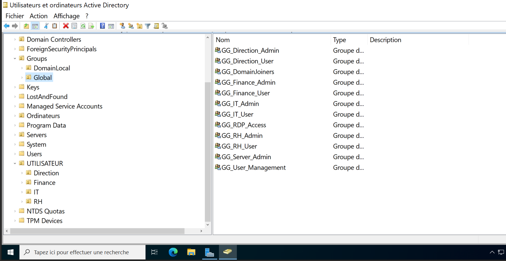
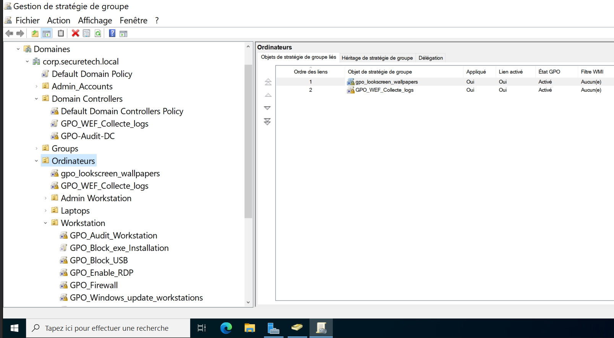
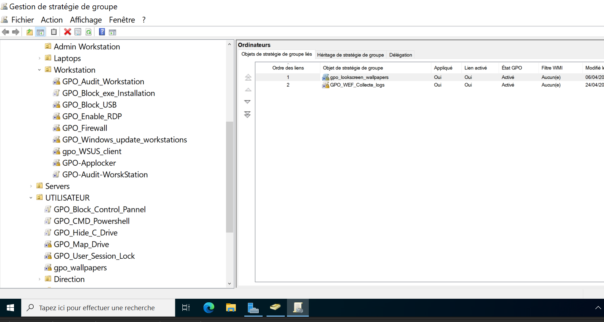
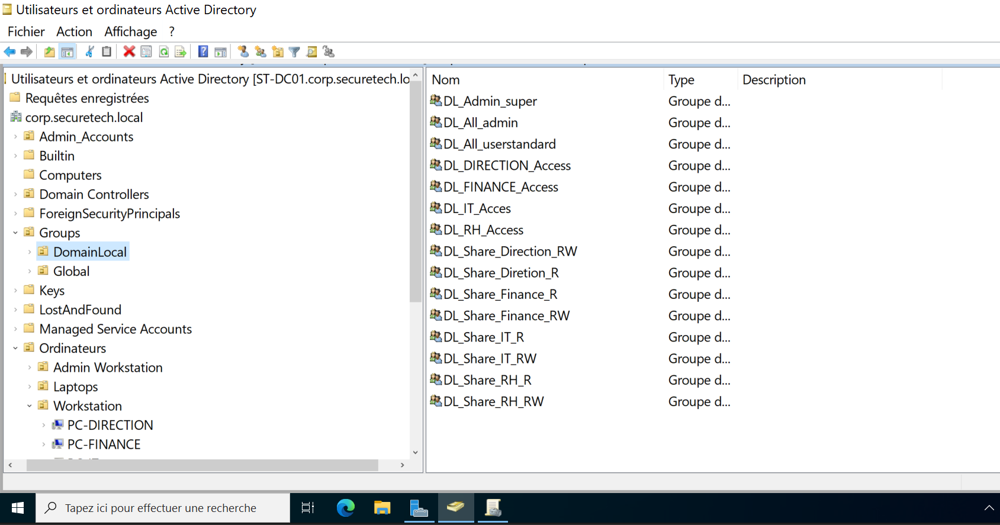
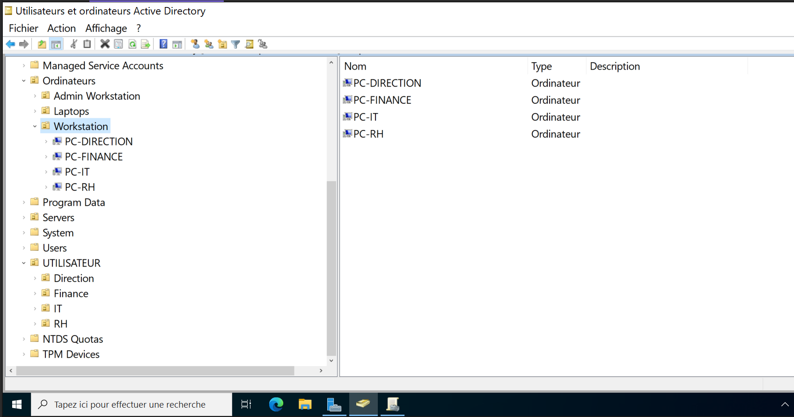

# 03 – Active Directory Design

# Introduction

Cette section présente l’architecture Active Directory déployée dans le laboratoire SecureTech ainsi que les principaux choix de conception associés.

L’objectif est de reproduire une infrastructure d’entreprise réaliste permettant :

- la centralisation des identités,
- la gestion des utilisateurs,
- l’administration des postes clients,
- le contrôle des accès,
- la gestion centralisée des ressources réseau.

L’environnement repose sur Windows Server 2022 et Active Directory Domain Services (AD DS).

---

# Active Directory Infrastructure Overview

L’infrastructure Active Directory est organisée autour d’un contrôleur de domaine principal situé dans le réseau SERVEURINTERNE.

Fonctions assurées :

- Active Directory Domain Services
- DNS interne
- Authentification Kerberos
- Gestion des utilisateurs et groupes
- Gestion des ordinateurs du domaine
- Serveur de fichiers

Nom du domaine :

```text
corp.securetech.local
```

Les postes clients Windows sont intégrés au domaine afin de bénéficier d’une administration centralisée et d’un contrôle cohérent des accès.



---

# Organizational Units (OU)

L’environnement est structuré à l’aide d’Unités d’Organisation (OU) afin d’améliorer :

- l’organisation logique du domaine,
- l’administration des ressources,
- l’application des stratégies de groupe (GPO),
- la délégation des tâches administratives.

Les principales OU déployées sont :

- OU_Users
- OU_Computers
- OU_Admin

Cette séparation permet une gestion plus claire et plus sécurisée des objets Active Directory.



---

# Users and Groups Management

Les utilisateurs et groupes Active Directory sont organisés selon leurs rôles afin de respecter le principe du moindre privilège.

Types de comptes utilisés :

- Administrateur du domaine
- Administrateur système
- Administrateur support
- Comptes utilisateurs standards

Les groupes permettent :

- la gestion centralisée des permissions,
- le contrôle des accès,
- l’attribution simplifiée des droits.



---

# Group Policy Management

Les stratégies de groupe (GPO) permettent d’appliquer des paramètres de sécurité et de configuration aux utilisateurs et aux machines du domaine.

Objectifs des GPO :

- sécurisation des postes,
- contrôle des configurations système,
- limitation des actions utilisateurs,
- administration centralisée.

Les politiques sont appliquées selon l’organisation des OU.





---

# AGDLP Implementation

L’infrastructure applique le modèle AGDLP afin d’organiser proprement les permissions Active Directory.

Principe appliqué :

```text
Accounts → Global Groups → Domain Local Groups → Permissions
```

Cette approche permet :

- une gestion simplifiée des accès,
- une meilleure évolutivité,
- une séparation claire entre utilisateurs et permissions.



---

# Computers Organization

Les ordinateurs du domaine sont organisés dans des OU spécifiques afin de faciliter :

- l’administration des postes,
- l’application des GPO,
- la gestion des accès,
- la supervision du parc informatique.

Les postes clients sont séparés selon leur rôle dans l’infrastructure.



---

# Domain Controller Role

Le contrôleur de domaine constitue le cœur de l’infrastructure.

Il permet :

- l’authentification centralisée via Kerberos,
- la gestion des comptes utilisateurs et groupes,
- la gestion des ordinateurs du domaine,
- la résolution DNS interne.

Le service DNS intégré à Active Directory est utilisé pour :

- résoudre les noms internes,
- permettre la localisation des services AD (enregistrements SRV),
- effectuer des requêtes externes via un mécanisme de redirection configuré vers pfSense.

Le firewall pfSense agit comme relais DNS externe afin de centraliser le contrôle du trafic sortant.

---

# File Server Integration

Le serveur assure également le rôle de serveur de fichiers.

Objectifs :

- centralisation des données,
- gestion centralisée des accès,
- application des permissions NTFS,
- sécurisation des ressources partagées.

Les accès reposent sur :

- les groupes Active Directory,
- les permissions NTFS,
- le principe du moindre privilège.

---

# Network Integration

Le contrôleur de domaine est situé dans le réseau :

```text
192.168.10.0/24
```

Les flux nécessaires depuis le réseau UTILISATEUR vers le contrôleur de domaine sont strictement contrôlés par pfSense.

Services autorisés :

- Kerberos (88)
- LDAP (389)
- DNS (53)
- RPC (135 + ports dynamiques)
- SMB (445)
- Global Catalog (3268)
- Kerberos Password Change (464)

Cette approche permet de limiter les communications au strict nécessaire.

---

# Security Principles

Plusieurs principes de sécurité sont appliqués :

- séparation des privilèges,
- isolation du contrôleur de domaine,
- contrôle strict des flux réseau,
- segmentation des accès,
- centralisation de l’authentification,
- utilisation exclusive du DNS Active Directory.

L’accès administratif est limité afin de protéger les ressources critiques.

---

# Current Limitations

Cette infrastructure reste un laboratoire pédagogique et présente certaines limites :

- un seul contrôleur de domaine,
- absence de redondance,
- absence de haute disponibilité

Ces choix simplifient le laboratoire mais ne correspondent pas aux bonnes pratiques d’un environnement de production réel.

---

# Conclusion

L’architecture Active Directory mise en place permet de centraliser :

- l’authentification,
- la gestion des utilisateurs,
- la gestion des ordinateurs,
- les stratégies de sécurité,
- les ressources partagées.

Elle constitue une base solide pour :

- le déploiement des GPO,
- le contrôle d’accès,
- l’administration centralisée,
- les scénarios offensifs et défensifs du laboratoire SecureTech.
