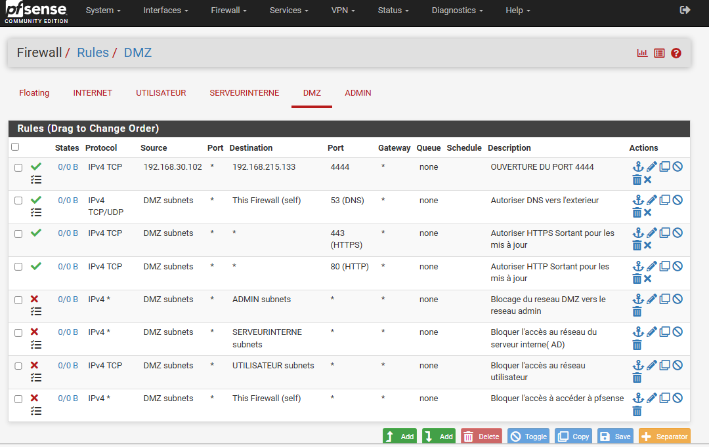

# 04 – Network Segmentation and Firewall Policy

# Introduction

Cette section présente la segmentation réseau ainsi que la politique de filtrage mise en place dans le laboratoire SecureTech à l’aide du firewall pfSense.

L’objectif est de reproduire une architecture d’entreprise réaliste dans laquelle :

- les différents segments réseau sont isolés,
- les flux sont strictement contrôlés,
- seules les communications nécessaires sont autorisées,
- les mouvements latéraux sont limités.

La segmentation réseau constitue un principe fondamental de cybersécurité permettant de réduire la surface d’attaque et de protéger les ressources critiques de l’infrastructure.

---

# NAT and Port Forwarding

Le firewall pfSense assure la publication contrôlée des services exposés vers le WAN à travers des règles NAT.

Services publiés :

- HTTP (80)
- FTP (21)

Ces services sont hébergés dans la DMZ afin d’éviter toute exposition directe du réseau interne.

Cette approche permet :

- d’isoler les services exposés,
- de contrôler les flux entrants,
- de limiter les risques de compromission du réseau interne.

---

# WAN Interface

L’interface WAN représente le point d’entrée externe de l’infrastructure.

Elle est connectée au réseau NAT fourni par VMware Workstation et est considérée comme non fiable.

Le firewall applique plusieurs mécanismes de sécurité :

- filtrage des connexions entrantes,
- contrôle des services publiés,
- isolation du réseau interne,
- journalisation des flux réseau.

Aucun accès direct aux réseaux internes n’est autorisé depuis le WAN.

---

# USER Network Rules

Le réseau UTILISATEUR contient les postes de travail des employés.

Les machines présentes dans ce segment sont jointes au domaine Active Directory et utilisent les services internes nécessaires à leur fonctionnement.

Communications autorisées :

- DNS vers le contrôleur de domaine,
- authentification Active Directory,
- accès HTTPS vers Internet.

Communications interdites :

- accès direct au réseau ADMIN,
- accès direct à la DMZ,
- accès non autorisés aux serveurs internes,
- accès à l’interface pfSense.

Cette politique permet de limiter les mouvements latéraux en cas de compromission d’un poste utilisateur.

---

# INTERNAL SERVER Network Rules

Le réseau SERVEURINTERNE héberge les composants critiques de l’infrastructure :

- Active Directory,
- DNS interne,
- services d’authentification.

Ce segment possède un niveau de protection élevé.

Communications autorisées :

- DNS,
- NTP,
- HTTPS sortant pour les mises à jour.

Communications interdites :

- accès non explicitement autorisés,
- communications vers la DMZ,
- flux inutiles vers les autres segments.

Cette approche permet de protéger les services centraux de l’environnement.

---

# DMZ Network Rules

La DMZ est utilisée pour héberger les systèmes exposés et les machines à risque élevé.

Dans ce laboratoire, elle contient une machine vulnérable utilisée pour les simulations offensives.

Services exposés :

- HTTP
- FTP

Les règles de sécurité empêchent toute communication initiée depuis la DMZ vers :

- le réseau SERVEURINTERNE,
- le réseau ADMIN,
- le réseau UTILISATEUR.

Seuls certains flux sortants nécessaires sont autorisés :

- DNS,
- HTTPS pour les mises à jour.

Cette isolation protège les ressources critiques de l’infrastructure.

---

# ADMIN Network Rules

Le réseau ADMIN est dédié aux opérations d’administration et de supervision.

Il possède le niveau de confiance le plus élevé de l’infrastructure.

Depuis ce réseau, les administrateurs peuvent :

- administrer les serveurs,
- gérer les postes utilisateurs,
- accéder à l’interface pfSense,
- superviser l’environnement.

Aucun accès entrant vers le réseau ADMIN n’est autorisé depuis les autres segments.

Cette séparation permet de protéger les opérations critiques d’administration.

---

# Security Principles

La politique de sécurité repose sur plusieurs principes fondamentaux :

## Principle of Least Privilege

Seules les communications nécessaires au fonctionnement de l’infrastructure sont autorisées.

Tout le reste du trafic est bloqué par défaut.

## Network Isolation

Les différents segments sont isolés afin de limiter :

- les déplacements latéraux,
- la propagation d’une compromission,
- les accès non autorisés.

## Controlled Administrative Access

Les opérations sensibles sont réalisées uniquement depuis le réseau ADMIN.

## Restricted Outbound Communications

Les accès sortants des serveurs internes et de la DMZ sont limités aux besoins strictement nécessaires.

---

# Conclusion

La segmentation réseau et la politique de filtrage mises en place dans SecureTech permettent :

- de réduire la surface d’attaque,
- de protéger les services critiques,
- de contrôler les communications inter-réseaux,
- de limiter les mouvements latéraux,
- de reproduire une architecture d’entreprise réaliste.

Le firewall pfSense constitue le point central de contrôle et applique l’ensemble des politiques de sécurité de l’infrastructure.
