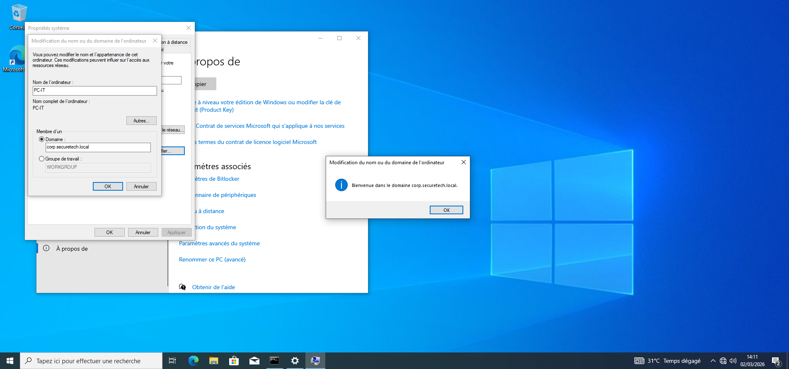
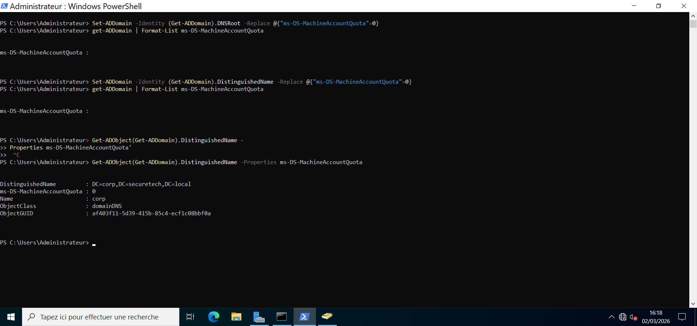
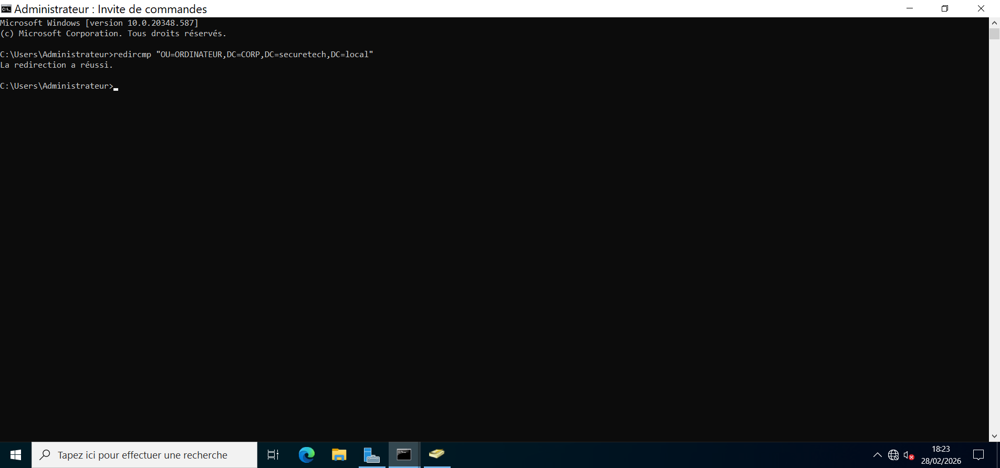
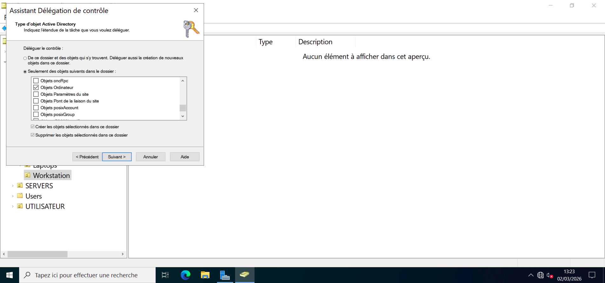
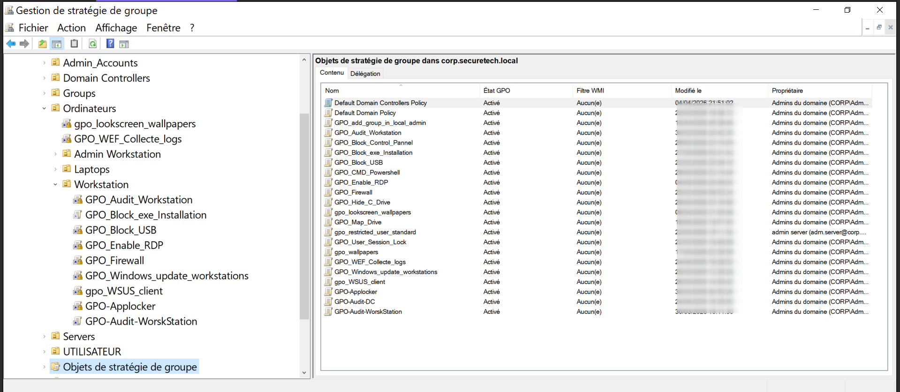
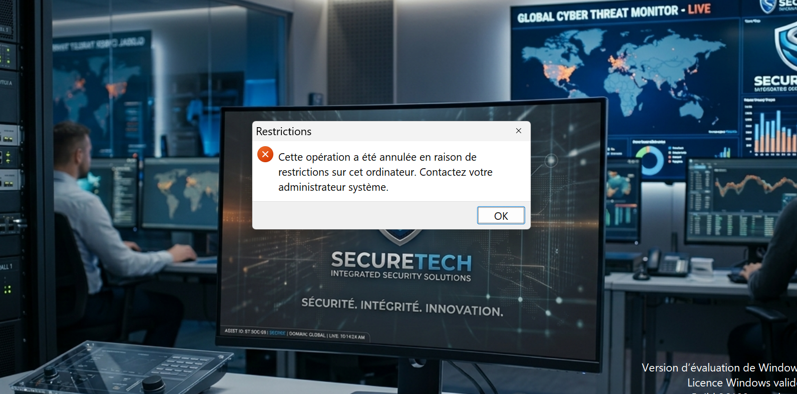
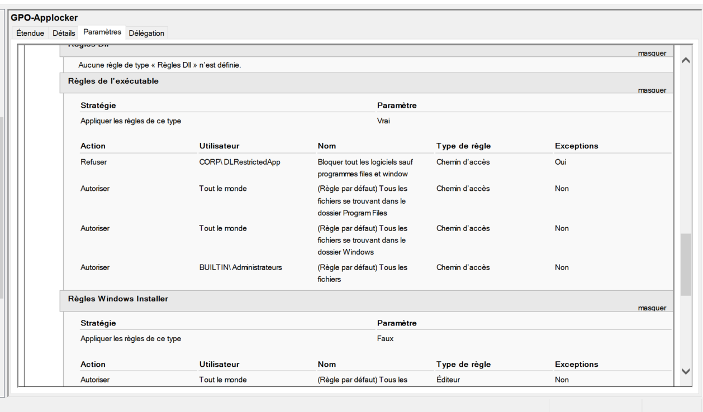
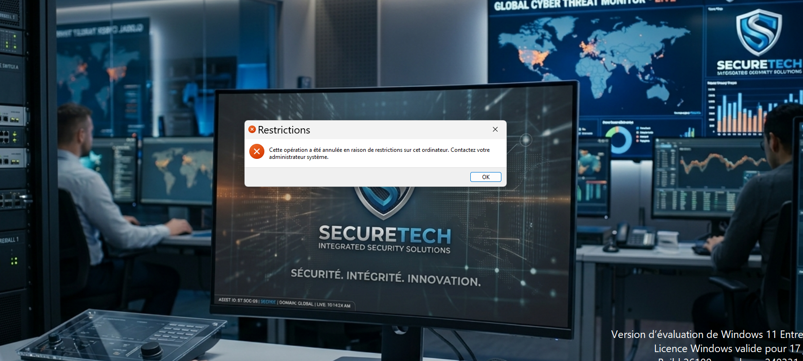

# Configuration des postes clients

## Présentation

Les postes de travail constituent le principal point d'entrée des utilisateurs vers le système d'information. Leur configuration doit garantir un équilibre entre facilité d'administration, sécurité et homogénéité afin d'assurer un environnement de travail stable.

Dans le cadre du laboratoire **SecureTech**, quatre postes clients ont été déployés et intégrés au domaine **corp.securetech.local**. Cette intégration permet de centraliser l'authentification, l'administration des équipements et le déploiement des stratégies de sécurité à partir du contrôleur de domaine.

Les postes déployés sont les suivants :

| Poste | Système d'exploitation | Service |
|--------|------------------------|----------|
| PC-IT | Windows 10 Professionnel | Informatique |
| PC-DIRECTION | Windows 10 Professionnel | Direction |
| PC-RH | Windows 11 Enterprise | Ressources Humaines |
| PC-FINANCE | Windows 11 Enterprise | Finance |
| PC-ADMIN | Window 10 Professionnel | Administrateur | 

---

# Intégration au domaine Active Directory

L'intégration des postes au domaine constitue la première étape de leur mise en service. Elle permet de centraliser l'authentification des utilisateurs, l'application des stratégies de groupe et l'administration des équipements depuis Active Directory.

Les postes rejoignent le domaine :

**corp.securetech.local**

La jointure est réalisée exclusivement à l'aide du compte de service :

**srv-join**

Ce compte possède uniquement les autorisations nécessaires à l'ajout de nouveaux ordinateurs dans le domaine. L'utilisation d'un compte dédié permet de limiter les privilèges accordés et de réduire la surface d'attaque en cas de compromission.

Une fois l'opération terminée, le poste est redémarré afin de finaliser son intégration et d'établir la relation d'approbation avec le contrôleur de domaine.

---

# Sécurisation du processus de jointure

Par défaut, Active Directory autorise un utilisateur authentifié à joindre plusieurs ordinateurs au domaine. Afin de renforcer la sécurité de l'infrastructure, ce comportement a été désactivé.

Le quota **MachineAccountQuota** a été fixé à **0**, empêchant tout utilisateur standard d'ajouter un ordinateur au domaine.

Désormais, seules les opérations réalisées avec le compte **srv-join** sont autorisées.

Cette mesure permet :

- de maîtriser l'intégration des nouveaux postes ;
- d'éviter l'ajout non autorisé de machines ;
- d'améliorer la traçabilité des opérations d'administration.

---

# Organisation des postes

Afin de simplifier l'administration de l'environnement, les ordinateurs ne sont pas stockés dans le conteneur **Computers** créé par défaut dans Active Directory.

Une redirection a été mise en place à l'aide de la commande **redircmp** afin que tous les nouveaux ordinateurs soient automatiquement créés dans l'unité d'organisation :

**Workstations**

Cette organisation facilite l'application des stratégies de groupe ainsi que l'administration quotidienne des postes.

Une délégation de contrôle a ensuite été appliquée afin d'autoriser le compte **srv-join** à créer des objets ordinateur uniquement dans cette unité d'organisation.

# Configuration réseau

Les postes clients utilisent une configuration réseau centralisée afin d'assurer une communication fiable avec les différents services de l'infrastructure.

Le serveur DNS configuré sur chaque machine correspond au contrôleur de domaine :

**192.168.10.103**

Ce choix permet aux postes de résoudre les enregistrements Active Directory indispensables à l'authentification, à la localisation des contrôleurs de domaine et au fonctionnement des stratégies de groupe.

Toutes les requêtes DNS internes sont traitées par le contrôleur de domaine. Pour les domaines externes, celui-ci redirige automatiquement les requêtes vers le pare-feu **pfSense**, qui assure la résolution Internet.

Cette architecture garantit une résolution de noms cohérente tout en conservant un contrôle centralisé des communications réseau.

Une fois cette configuration appliquée, les postes communiquent correctement avec les services Active Directory ainsi qu'avec les ressources du réseau interne.

---

# Authentification des utilisateurs

Après leur intégration au domaine, les utilisateurs ouvrent leur session à l'aide de leurs identifiants Active Directory.

L'authentification centralisée présente plusieurs avantages :

- gestion unique des comptes utilisateurs ;
- application automatique des stratégies de groupe ;
- contrôle des autorisations d'accès ;
- traçabilité des connexions.

Les comptes locaux ne sont plus utilisés pour les connexions quotidiennes, ce qui limite les risques liés à une administration décentralisée.

L'ouverture de session valide le bon fonctionnement de la communication entre le poste client et le contrôleur de domaine.

---

# Gestion des privilèges

Afin de respecter le principe du moindre privilège, les utilisateurs disposent exclusivement de comptes standards.

Aucun utilisateur ne possède de droits administrateur local sur son poste de travail.

Cette approche permet de réduire significativement les risques liés :

- à l'installation de logiciels non autorisés ;
- aux modifications accidentelles de la configuration système ;
- à l'exécution de logiciels malveillants avec des privilèges élevés.

Les opérations d'administration restent réservées aux comptes spécifiquement autorisés.

---

# Accès aux ressources réseau

Les documents partagés de l'entreprise sont centralisés sur le serveur de fichiers :

**ST-FILESERVER01**

Afin d'éviter toute configuration manuelle sur les postes, les lecteurs réseau sont déployés automatiquement à l'aide des **Group Policy Preferences**.

Configuration appliquée :

**User Configuration → Preferences → Windows Settings → Drive Maps**

Cette méthode permet :

- un déploiement entièrement automatisé ;
- une configuration uniforme sur tous les postes ;
- une administration simplifiée des ressources réseau ;
- une attribution des lecteurs selon les utilisateurs ou les groupes de sécurité.

Après l'ouverture de session, les lecteurs réseau apparaissent automatiquement dans l'Explorateur Windows sans intervention de l'utilisateur.

Cette automatisation améliore l'expérience utilisateur tout en réduisant les interventions de support liées à la configuration des postes.

# Déploiement des stratégies de groupe (GPO)

Après l'intégration des postes au domaine, les stratégies de groupe (Group Policy Objects - GPO) ont été déployées afin d'assurer une configuration homogène et de renforcer la sécurité des postes de travail.

L'utilisation des GPO permet d'appliquer automatiquement les paramètres définis par l'administrateur sans intervention manuelle sur chaque machine.

Toutes les stratégies sont liées à l'unité d'organisation **Workstations**, garantissant une administration centralisée des quatre postes clients.

---

# Validation des stratégies

Une fois les stratégies déployées, chaque poste met à jour sa configuration grâce à la commande :

**gpupdate /force**

Cette opération force l'application immédiate des nouvelles stratégies sans attendre le cycle de mise à jour automatique.

Le résultat confirme la bonne application des stratégies côté ordinateur et côté utilisateur.

Afin de vérifier précisément les stratégies appliquées, un rapport est généré avec la commande **gpresult**.

Cette vérification permet de confirmer que chaque poste reçoit bien les stratégies prévues par l'administrateur.

---

# Restriction de l'invite de commandes et de PowerShell

L'invite de commandes (CMD) et PowerShell offrent un accès direct aux fonctions d'administration du système. Entre de mauvaises mains, ces outils peuvent être utilisés pour contourner certaines protections ou modifier la configuration des postes.

Afin de réduire ce risque, leur utilisation a été restreinte sur les postes utilisateurs.

Le poste **PC-IT** constitue une exception afin de permettre aux administrateurs d'effectuer les opérations de maintenance nécessaires.

Cette restriction est appliquée sur :

- PC-DIRECTION
- PC-RH
- PC-FINANCE

Cette configuration limite considérablement les possibilités d'exécution de commandes non autorisées.

---

# Restriction du Panneau de configuration

Le Panneau de configuration permet de modifier de nombreux paramètres système susceptibles d'impacter le fonctionnement du poste.

Afin d'éviter toute modification non autorisée, son accès est interdit aux utilisateurs standards.

Cette mesure contribue à maintenir une configuration homogène sur l'ensemble des postes.

---

# Contrôle des périphériques USB

Les périphériques de stockage amovibles représentent un vecteur fréquent d'introduction de logiciels malveillants et de fuite de données.

Une stratégie de groupe a été déployée afin de contrôler leur utilisation sur les postes clients.

Cette politique permet de limiter les risques liés :

- à la copie non autorisée de données ;
- à l'introduction de supports infectés ;
- aux pertes d'informations sensibles.

La restriction est appliquée automatiquement lors de l'ouverture de session grâce aux stratégies de groupe.

---

# Déploiement d'AppLocker

Les postes **PC-RH** et **PC-FINANCE**, exécutant Windows 11 Enterprise, bénéficient d'un niveau de protection supplémentaire grâce à **AppLocker**.

Cette fonctionnalité permet de contrôler précisément les applications autorisées à s'exécuter sur le système.

Seules les applications validées par l'administrateur peuvent être lancées.

Cette stratégie réduit fortement les risques liés :

- aux logiciels malveillants ;
- aux applications non approuvées ;
- à l'exécution de programmes téléchargés par les utilisateurs.

Les postes **PC-IT** et **PC-DIRECTION** ne disposent pas de cette stratégie, leur système d'exploitation ou leur rôle nécessitant une politique différente.

---

parefeu acces interdit 

compte verouillé 

# Résultat du durcissement

À l'issue du déploiement des stratégies de groupe, les postes clients disposent d'une configuration homogène et conforme aux exigences de sécurité définies pour l'infrastructure SecureTech.

Les utilisateurs travaillent dans un environnement contrôlé où les principales fonctions d'administration sont restreintes, les ressources réseau sont automatiquement déployées et les paramètres de sécurité sont appliqués de manière centralisée.

Cette approche réduit les risques d'erreurs de configuration, simplifie l'administration quotidienne et améliore significativement le niveau de sécurité global du parc informatique.

# Difficultés rencontrées

Le déploiement des postes clients a nécessité plusieurs phases de validation afin de garantir leur bonne intégration à l'infrastructure Active Directory.

Les principales difficultés rencontrées sont les suivantes :

- intégration correcte des postes au domaine ;
- validation de la résolution DNS avant la jointure ;
- application des stratégies de groupe sur l'ensemble des postes ;
- adaptation des politiques de sécurité selon le rôle des utilisateurs ;
- déploiement d'AppLocker uniquement sur les postes Windows 11 Enterprise ;
- vérification de la communication avec le serveur Zabbix.

Chaque difficulté a été résolue à l'aide des outils de diagnostic Windows (`gpupdate`, `gpresult`, journaux d'événements et console Active Directory).

---

# Résultats obtenus

À l'issue du déploiement, les quatre postes clients sont entièrement intégrés à l'infrastructure SecureTech.

Les objectifs fixés ont été atteints :

- intégration réussie au domaine Active Directory ;
- authentification centralisée des utilisateurs ;
- application automatique des stratégies de groupe ;
- déploiement des lecteurs réseau ;
- restriction des privilèges utilisateurs ;
- durcissement des postes grâce aux GPO ;
- mise en œuvre d'AppLocker sur les postes sensibles ;
- supervision des postes par la plateforme Zabbix.

Cette configuration garantit une administration centralisée, une meilleure homogénéité du parc informatique et un renforcement significatif de la sécurité des postes de travail.

---

# Conclusion

Le déploiement des postes clients constitue une étape essentielle de l'infrastructure SecureTech. Au-delà de leur intégration au domaine, ce projet a permis de mettre en œuvre une administration centralisée reposant sur Active Directory, les stratégies de groupe et la supervision des équipements.

L'application du principe du moindre privilège, le déploiement automatisé des ressources réseau et le durcissement des postes démontrent une approche orientée bonnes pratiques d'administration système.

Cette architecture constitue une base solide pour l'exploitation quotidienne du système d'information et pour le déploiement des autres services de l'environnement SecureTech.
