# Infrastructure Hardening

## Introduction

La sécurisation d'une infrastructure ne repose pas uniquement sur le déploiement d'un pare-feu ou d'un antivirus. Elle résulte d'un ensemble cohérent de mesures visant à réduire la surface d'attaque, limiter les privilèges, renforcer la résilience des systèmes et améliorer les capacités de détection.

Dans le cadre du laboratoire **SecureTech**, une stratégie de durcissement (*Hardening*) a été mise en œuvre sur l'ensemble de l'infrastructure afin de reproduire les bonnes pratiques appliquées dans un environnement d'entreprise.

Cette démarche couvre plusieurs couches de sécurité :

- le contrôleur de domaine Active Directory ;
- les postes clients Windows ;
- le pare-feu pfSense ;
- la supervision avec Zabbix ;
- la centralisation des journaux avec Windows Event Forwarding (WEF) et NXLog.

L'objectif est de mettre en place une infrastructure capable de limiter les risques liés aux erreurs de configuration, aux attaques internes, aux compromissions de comptes et aux mouvements latéraux tout en améliorant la visibilité sur les événements de sécurité.

---

# Objectifs

Le durcissement de l'infrastructure poursuit plusieurs objectifs :

- réduire la surface d'attaque des systèmes Windows ;
- appliquer le principe du moindre privilège ;
- protéger les comptes et les ressources Active Directory ;
- limiter les possibilités d'exécution de code non autorisé ;
- renforcer la sécurité des accès distants ;
- améliorer la traçabilité des actions des utilisateurs ;
- centraliser les journaux de sécurité ;
- permettre une détection proactive des incidents grâce à la supervision.

Cette approche constitue une étape essentielle avant la réalisation des scénarios d'attaque et l'analyse des mécanismes de défense présentés dans les sections suivantes du projet.

# Durcissement d'Active Directory

Active Directory constitue le cœur de l'infrastructure SecureTech. Une compromission du contrôleur de domaine aurait un impact direct sur l'ensemble des utilisateurs, des serveurs et des ressources de l'entreprise.

Afin de réduire ce risque, plusieurs mesures de sécurité ont été appliquées dès la phase de conception.

---

## Politique de mot de passe

Une stratégie de mot de passe a été déployée au niveau du domaine afin d'imposer un niveau minimal de sécurité pour tous les comptes Active Directory.

Cette politique définit notamment :

- une longueur minimale des mots de passe ;
- des exigences de complexité ;
- une durée de vie des mots de passe ;
- un historique empêchant leur réutilisation immédiate.

L'objectif est de limiter les attaques par dictionnaire, les attaques par force brute ainsi que l'utilisation de mots de passe faibles.

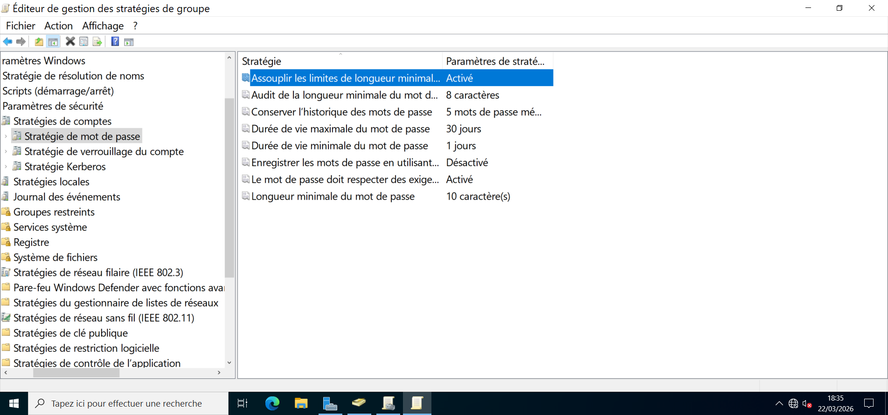

---

## Politique de verrouillage des comptes

Afin de ralentir les tentatives de connexion malveillantes, une politique de verrouillage des comptes a été mise en œuvre.

Après plusieurs tentatives d'authentification échouées, le compte est automatiquement verrouillé pendant une durée définie.

Cette mesure permet de réduire efficacement les risques liés aux attaques par force brute contre les comptes Active Directory.

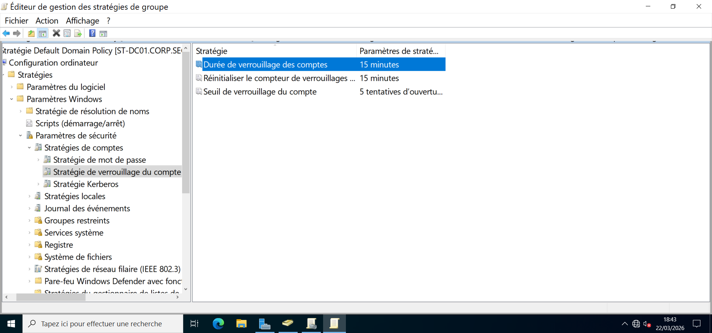

---

## Politique d'audit

Une politique d'audit a été activée afin d'améliorer la traçabilité des actions réalisées sur l'infrastructure.

Les événements suivants sont notamment enregistrés :

- authentifications réussies et échouées ;
- modifications des objets Active Directory ;
- changements de privilèges ;
- accès aux ressources sensibles ;
- événements système critiques.

Ces journaux sont ensuite centralisés grâce à Windows Event Forwarding (WEF), facilitant leur analyse et la détection d'activités suspectes.

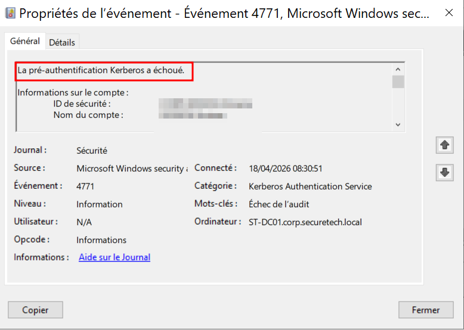

---

## Restriction de l'ajout de machines au domaine

Par défaut, Active Directory autorise les utilisateurs authentifiés à joindre plusieurs ordinateurs au domaine.

Dans cette infrastructure, ce comportement a été désactivé en positionnant **MachineAccountQuota** à **0**.

Ainsi, aucun utilisateur standard ne peut intégrer une nouvelle machine sans autorisation explicite.

Cette mesure limite le risque d'introduction d'équipements non maîtrisés au sein du domaine.

---

## Organisation des postes dans une OU dédiée

Les postes utilisateurs ne sont pas stockés dans le conteneur par défaut **Computers**.

Une redirection automatique a été mise en place afin que chaque nouveau poste rejoigne directement l'unité d'organisation **Workstations**.

Cette organisation facilite :

- l'application des stratégies de groupe ;
- l'administration centralisée ;
- la délégation des droits ;
- la gestion du cycle de vie des postes.

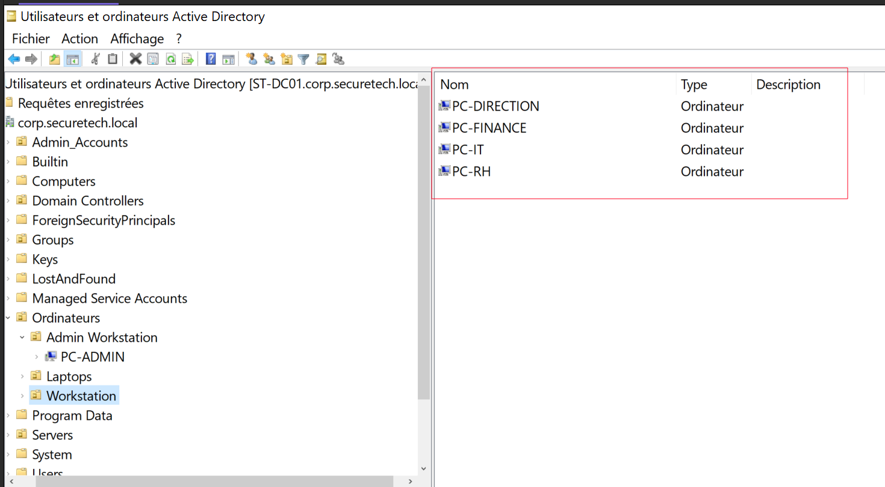

---

### Résultat

Ces mesures permettent de renforcer la sécurité d'Active Directory dès son déploiement en limitant les privilèges, en améliorant la traçabilité des événements et en garantissant une administration plus maîtrisée des postes du domaine.

Elles constituent le socle de sécurité sur lequel reposent les autres mécanismes de protection de l'infrastructure SecureTech.

# Durcissement des postes Windows

Les postes utilisateurs représentent l'un des principaux points d'entrée d'une attaque. Ils ont donc été configurés afin de limiter les actions pouvant compromettre l'infrastructure tout en conservant un environnement de travail fonctionnel.

L'ensemble des paramètres présentés dans cette section est appliqué de manière centralisée via les stratégies de groupe (GPO) du domaine Active Directory.

---

## Pare-feu Windows

Le pare-feu Windows est activé sur les postes clients afin de filtrer les communications réseau et de limiter les connexions non autorisées.

Cette configuration constitue une première ligne de défense contre les mouvements latéraux et les tentatives d'accès non légitimes entre les machines du domaine.

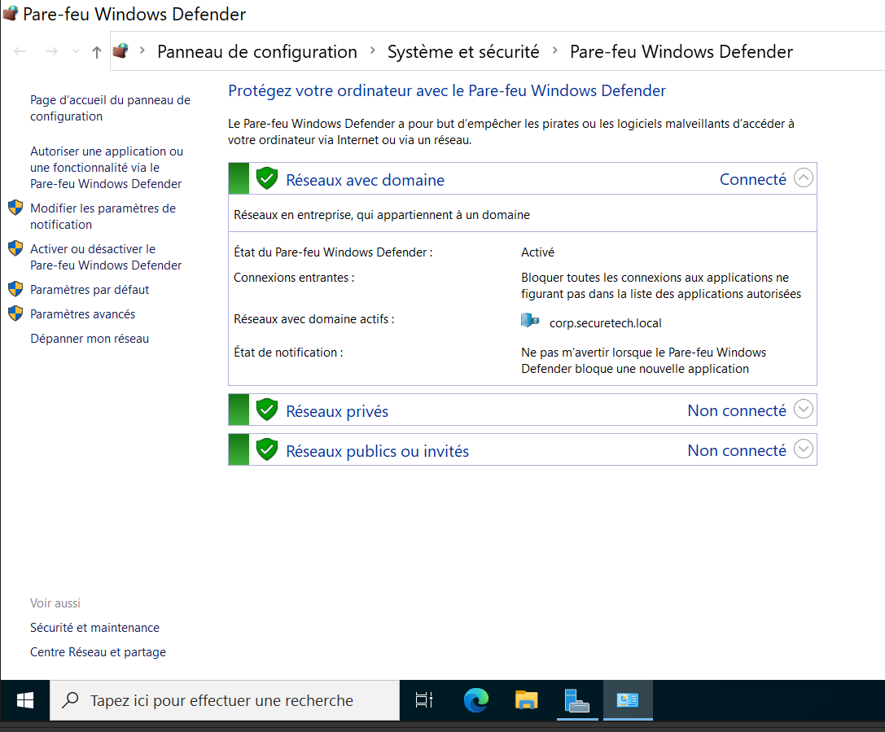

---

## Sécurisation des accès Bureau à distance (RDP)

L'accès à distance est limité aux utilisateurs autorisés grâce à une stratégie de groupe dédiée.

Seuls les comptes appartenant au groupe prévu à cet effet peuvent établir une connexion RDP.

Cette restriction réduit considérablement les risques d'accès non autorisés aux postes et serveurs.

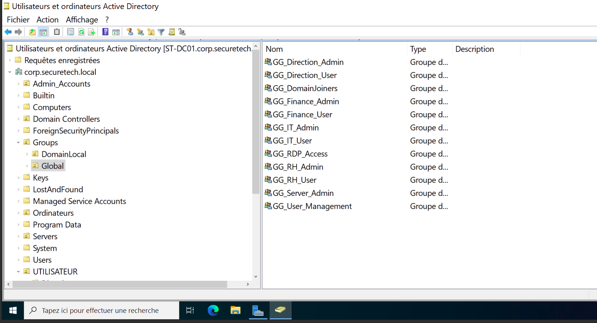

En complément, des restrictions supplémentaires rendent les tentatives de connexion non autorisées plus difficiles.

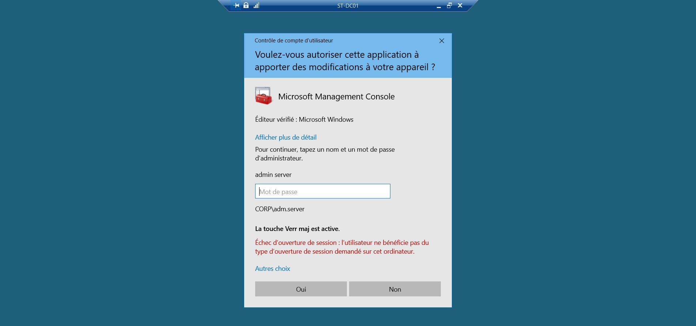

---

## Restriction des périphériques USB

L'utilisation des périphériques de stockage USB est bloquée pour les utilisateurs standards.

Cette politique vise à limiter :

- les risques d'exfiltration de données ;
- l'introduction de logiciels malveillants ;
- les copies non autorisées de fichiers sensibles.

L'accès reste réservé aux comptes administrateurs lorsque cela est nécessaire.

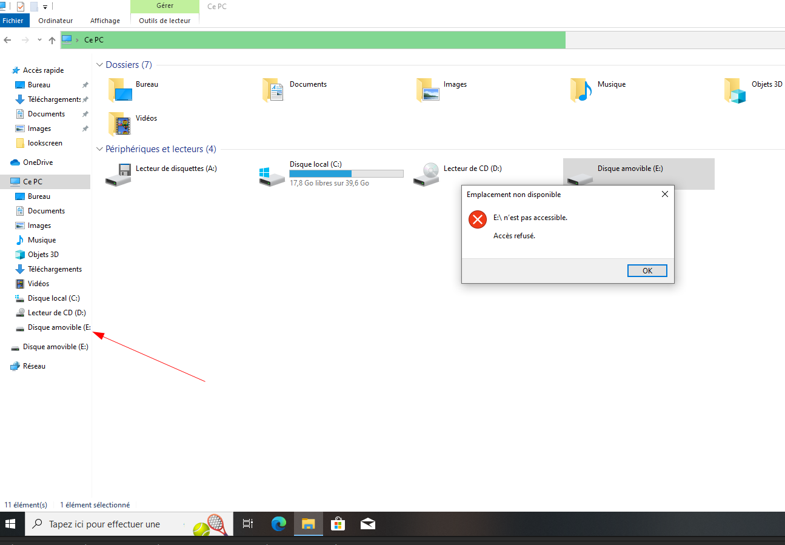

---

## Restriction du Panneau de configuration

L'accès au Panneau de configuration est désactivé afin d'empêcher les utilisateurs de modifier la configuration système.

Cette mesure réduit les erreurs de manipulation et garantit une configuration homogène sur l'ensemble des postes du domaine.

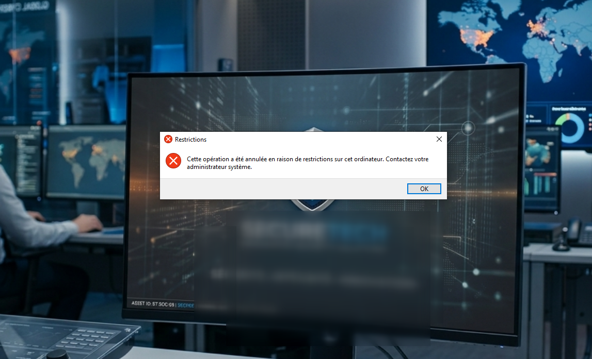

---

## Blocage de l'invite de commandes (CMD)

L'invite de commandes est désactivée pour les utilisateurs standards.

Cette restriction limite l'exécution de commandes système susceptibles d'être utilisées lors d'une compromission.

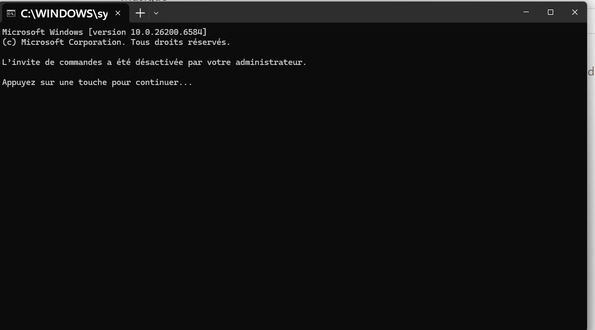

---

## Restriction de PowerShell

PowerShell constitue un outil particulièrement utilisé par les administrateurs mais également par de nombreux attaquants lors des phases de post-exploitation.

Son utilisation est donc restreinte afin de limiter l'exécution de scripts non autorisés sur les postes utilisateurs.

---

## Contrôle des applications avec AppLocker

Les postes Windows 11 Enterprise (RH et Finance) utilisent **Microsoft AppLocker** afin de contrôler précisément les applications pouvant être exécutées.

Des règles ont été définies pour n'autoriser que les programmes approuvés par l'entreprise.

Cette approche permet de limiter efficacement :

- l'exécution de logiciels inconnus ;
- les applications non autorisées ;
- certains scénarios d'exécution de malwares.

Les tentatives d'exécution d'applications interdites sont automatiquement bloquées par le système.

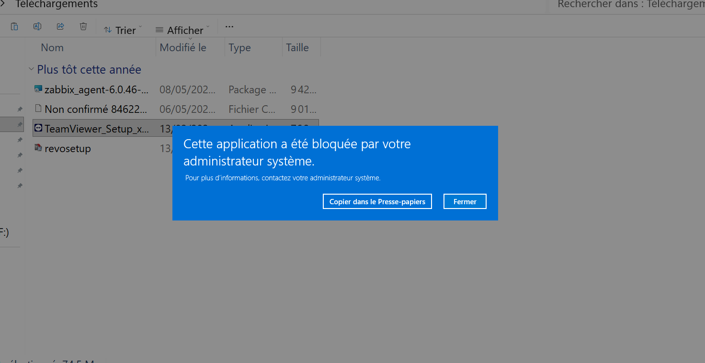

Une documentation détaillée des différentes règles AppLocker est présentée dans la configuration des postes Windows Enterprise.

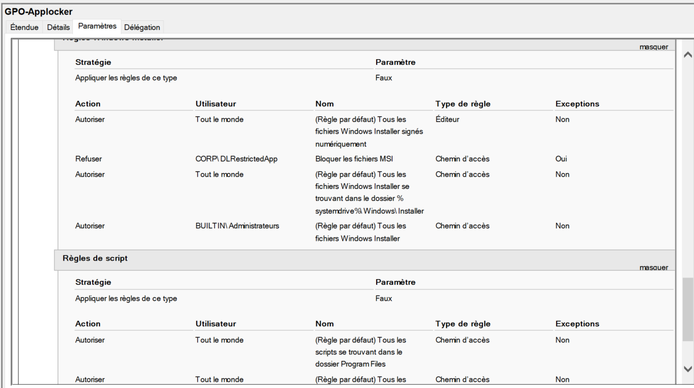

---

## Masquage du disque système

Le lecteur système **C:** est masqué pour les utilisateurs afin de limiter l'accès direct aux fichiers du système d'exploitation.

Cette mesure contribue à réduire les manipulations involontaires susceptibles d'affecter la stabilité du poste.

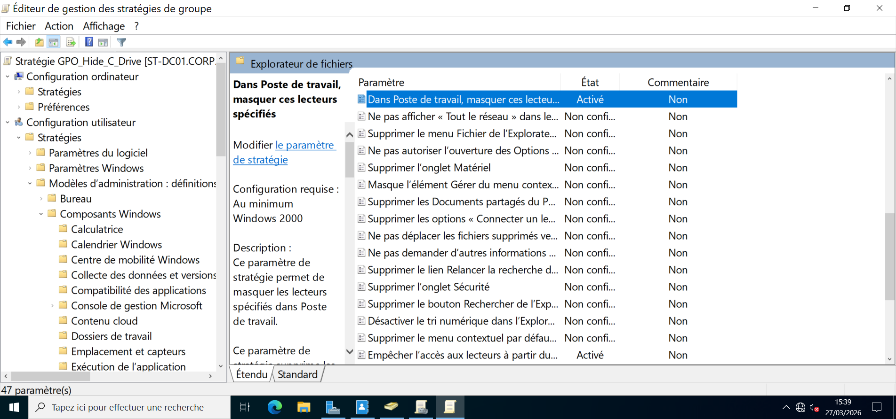

---

### Résultat

Grâce à ces politiques de sécurité, les postes clients disposent d'un niveau de protection renforcé tout en restant administrables de manière centralisée.

La combinaison des GPO, des restrictions d'exécution, du contrôle des applications et de la limitation des privilèges permet de réduire significativement la surface d'attaque des postes utilisateurs de l'infrastructure SecureTech.
