# Logging centralisé et Windows Event Forwarding (WEF)

## Introduction

Dans une infrastructure d'entreprise, la centralisation des journaux est indispensable pour détecter rapidement les incidents, faciliter les investigations et disposer d'une visibilité globale sur l'ensemble du système d'information.

Dans le cadre du projet **Enterprise Network Security Lab**, une infrastructure de collecte centralisée a été mise en place afin de regrouper les événements Windows ainsi que les journaux réseau provenant du pare-feu pfSense.

L'objectif était de reproduire une architecture couramment rencontrée en entreprise où les événements de sécurité sont centralisés sur un serveur unique avant une future intégration vers une plateforme SIEM.

L'architecture repose sur les composants suivants :

- Windows Event Forwarding (WEF)
- Windows Event Collector (WEC)
- WinRM
- Group Policy (GPO)
- NXLog
- Syslog (pfSense)

Cette approche permet de centraliser automatiquement les journaux des serveurs, des postes clients et du pare-feu afin d'améliorer les capacités de supervision et d'analyse des incidents.

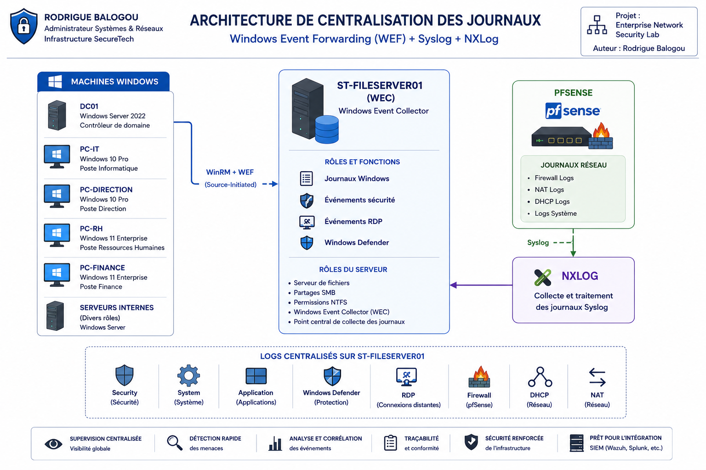

---

## Architecture de collecte

Le serveur **ST-FILESERVER01** joue un rôle central dans l'infrastructure.

En plus d'assurer les fonctions de serveur de fichiers, il héberge également le service **Windows Event Collector (WEC)** chargé de recevoir les événements Windows provenant des différentes machines du domaine.

Les postes Windows utilisent **Windows Event Forwarding (WEF)** via le protocole **WinRM**, tandis que le pare-feu **pfSense** transmet ses journaux au format **Syslog**. Ces derniers sont ensuite traités par **NXLog**, qui centralise les événements réseau sur le même serveur.

Cette architecture permet de regrouper les journaux système et réseau au sein d'un point de collecte unique, facilitant ainsi les opérations de supervision, de corrélation et d'investigation.

Les machines intégrées à cette collecte sont :

- Contrôleur de domaine (ST-DC01)
- Serveur de fichiers (ST-FILESERVER01)
- Serveur WSUS
- Poste Windows 10 IT
- Poste Windows 10 Direction
- Poste Windows 11 RH
- Poste Windows 11 Finance
- Pare-feu pfSense

Les événements centralisés comprennent notamment :

- Security
- System
- Application
- Windows Defender
- Connexions RDP
- Journaux Firewall
- Journaux DHCP
- Journaux NAT

Cette architecture constitue une base solide pour une future intégration avec une plateforme SIEM telle que Wazuh ou Splunk.

---

## Déploiement du serveur Windows Event Collector (WEC)

Afin de centraliser les événements Windows de l'ensemble de l'infrastructure, le serveur **ST-FILESERVER01** a été configuré comme **Windows Event Collector (WEC)**.

Ce choix permet de regrouper plusieurs services sur un serveur interne déjà dédié aux fonctions d'infrastructure tout en conservant un point unique de collecte des journaux.

La première étape a consisté à activer les services nécessaires au fonctionnement de Windows Event Forwarding.

Le service **Windows Event Collector** a été configuré avec un démarrage automatique afin de garantir la réception des événements après chaque redémarrage du serveur.

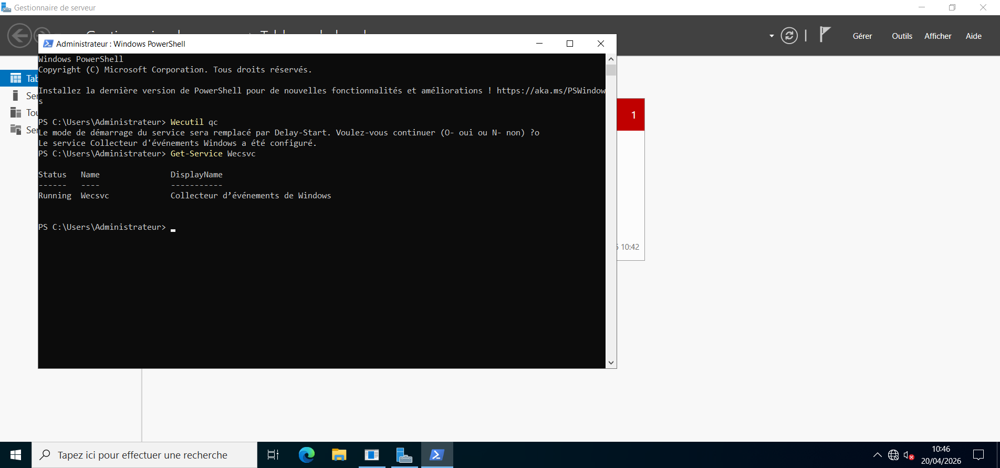

---

### Activation de WinRM

Windows Event Forwarding s'appuie sur **Windows Remote Management (WinRM)** pour transporter les événements entre les machines du domaine et le serveur collecteur.

Le service WinRM a donc été activé sur le serveur afin d'autoriser les communications distantes nécessaires au fonctionnement de WEF.

Cette étape constitue un prérequis indispensable avant la création des abonnements de collecte.

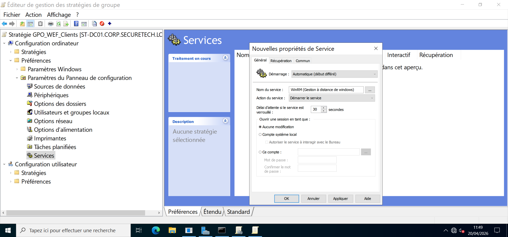

---

### Déploiement de la configuration via les stratégies de groupe

Plutôt que de configurer individuellement chaque poste de travail, l'ensemble des paramètres WinRM et Windows Event Forwarding a été déployé à l'aide des **Group Policy Objects (GPO)**.

Cette approche garantit une configuration homogène sur toutes les machines intégrées au domaine Active Directory.

La première stratégie active automatiquement le service **WinRM** sur les postes clients et serveurs.

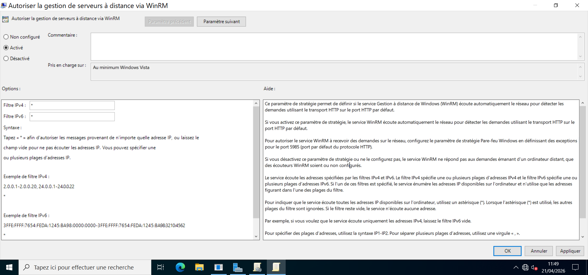

Une seconde stratégie configure le mécanisme **Windows Event Forwarding** afin que les postes connaissent automatiquement le serveur collecteur auquel transmettre leurs événements.

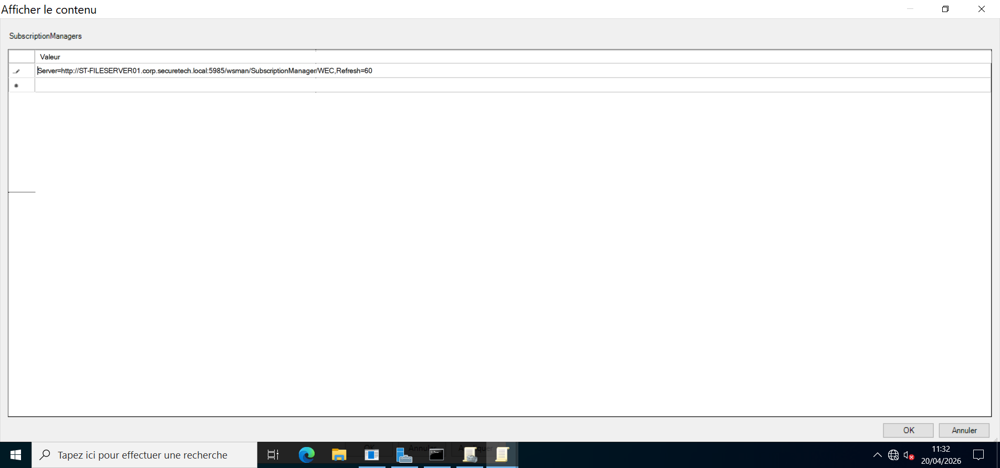

La politique définit notamment l'adresse du serveur WEC ainsi que les paramètres nécessaires au transport sécurisé des journaux.

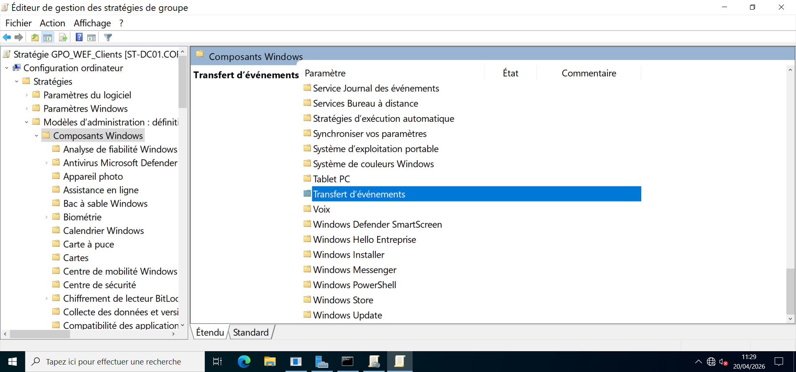

Grâce à cette automatisation, toute nouvelle machine intégrée au domaine reçoit automatiquement la configuration de collecte des événements sans intervention manuelle de l'administrateur.

Cette méthode correspond aux bonnes pratiques de déploiement utilisées dans les environnements Active Directory en entreprise.

---

## Configuration des abonnements WEF

Une fois les services et les stratégies de groupe déployés, une **subscription Windows Event Forwarding** a été créée sur le serveur **ST-FILESERVER01**.

Le mode **Source-Initiated** a été retenu. Dans cette configuration, ce sont les machines du domaine qui initient automatiquement la connexion vers le serveur collecteur après l'application des stratégies de groupe.

Cette méthode facilite considérablement le déploiement dans un environnement Active Directory puisqu'aucune configuration individuelle n'est nécessaire sur chaque poste.

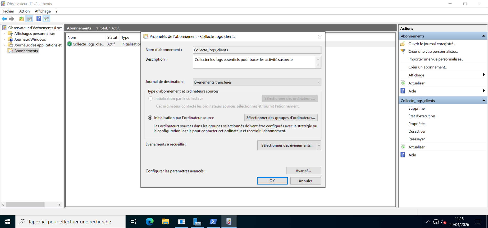

---

### Paramètres de la souscription

La souscription a été configurée afin de collecter automatiquement les événements provenant des ordinateurs autorisés du domaine.

Les principaux paramètres définis sont :

- Mode **Source-Initiated**
- Collecte automatique des événements
- Utilisation de WinRM comme protocole de transport
- Authentification intégrée Active Directory

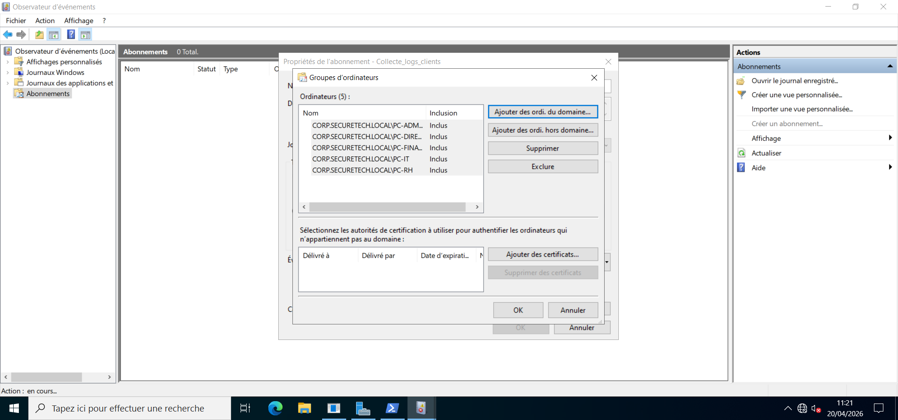

Après validation de la configuration, la souscription devient active et attend les connexions des machines clientes.

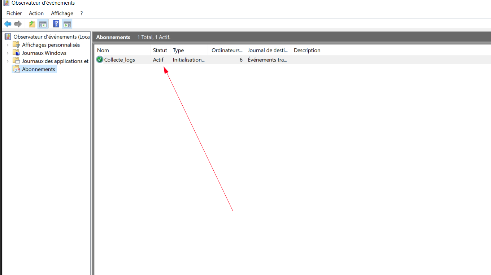

---

### Validation de la souscription

Les propriétés de la souscription permettent de vérifier son état de fonctionnement ainsi que les informations relatives aux ordinateurs participants.

Cette étape permet notamment de confirmer :

- que la souscription est correctement enregistrée ;
- que le serveur WEC écoute les connexions entrantes ;
- que les machines du domaine peuvent transmettre leurs événements.

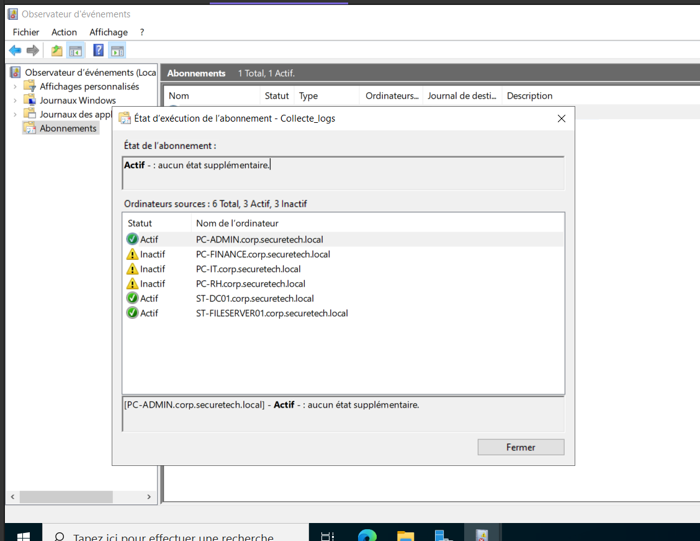

Une fois les premières machines connectées, les événements apparaissent automatiquement dans l'Observateur d'événements du serveur collecteur.

Le journal **Forwarded Events** devient alors le point central de consultation de tous les événements remontés par les différents serveurs et postes clients.

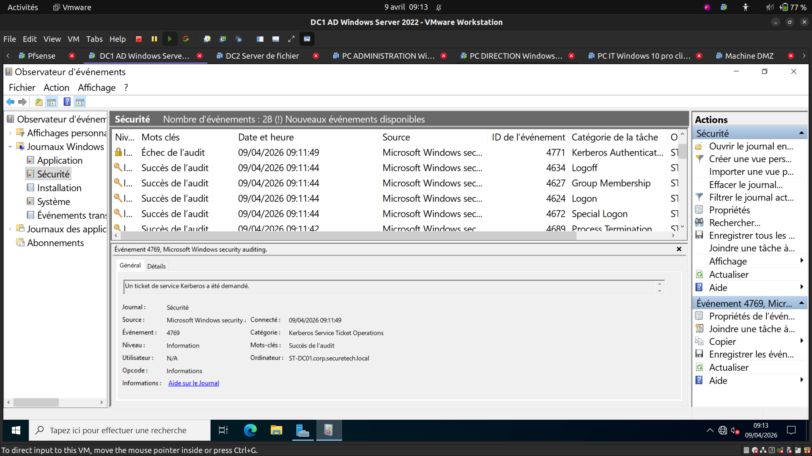

---

### Journaux centralisés

La souscription a été configurée afin de centraliser les principaux journaux Windows nécessaires à la supervision de l'infrastructure.

Les catégories collectées comprennent notamment :

- Security
- System
- Application
- Windows Defender
- Événements liés aux connexions RDP

Cette sélection permet de disposer d'une visibilité suffisante pour détecter les incidents de sécurité, les erreurs système ainsi que les activités d'administration.

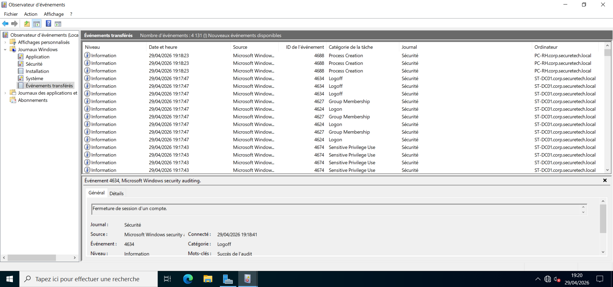

---

## Centralisation des journaux pfSense avec NXLog

En complément des événements Windows, les journaux du pare-feu **pfSense** ont également été intégrés à l'infrastructure de collecte afin d'obtenir une visibilité globale sur les activités réseau.

L'objectif était de centraliser, sur un même serveur, les événements provenant des systèmes Windows et ceux générés par le pare-feu.

Cette architecture facilite l'analyse des incidents et prépare une future intégration avec une plateforme SIEM.

---

### Configuration du serveur Syslog sur pfSense

Le serveur **pfSense** a été configuré pour transmettre automatiquement ses journaux vers **ST-FILESERVER01** à l'aide du protocole **Syslog**.

Les principaux journaux envoyés comprennent :

- Firewall Logs
- NAT Logs
- DHCP Logs
- System Logs

Cette configuration permet de superviser l'activité du pare-feu sans avoir à consulter directement son interface d'administration.

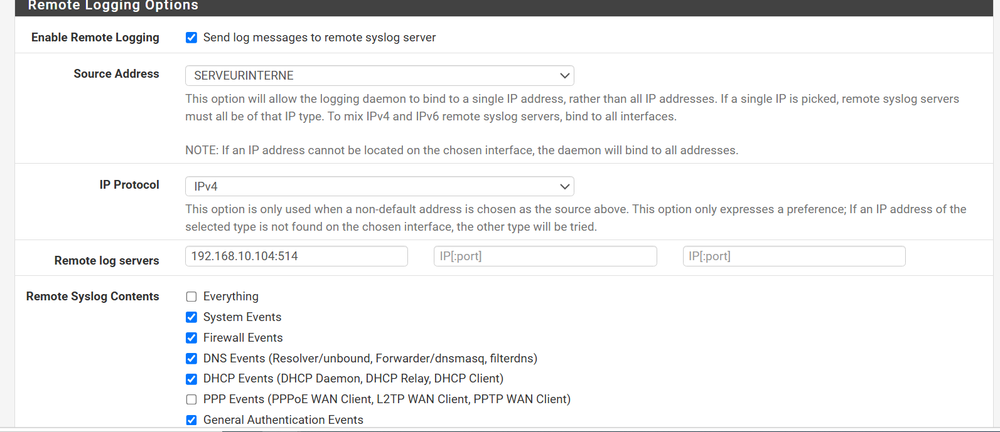

---

### Déploiement de NXLog

Le serveur **ST-FILESERVER01** héberge également **NXLog**, chargé de traiter les journaux Syslog reçus depuis pfSense.

NXLog assure la lecture des fichiers de journalisation puis les centralise sur le serveur afin qu'ils puissent être consultés avec les événements Windows.

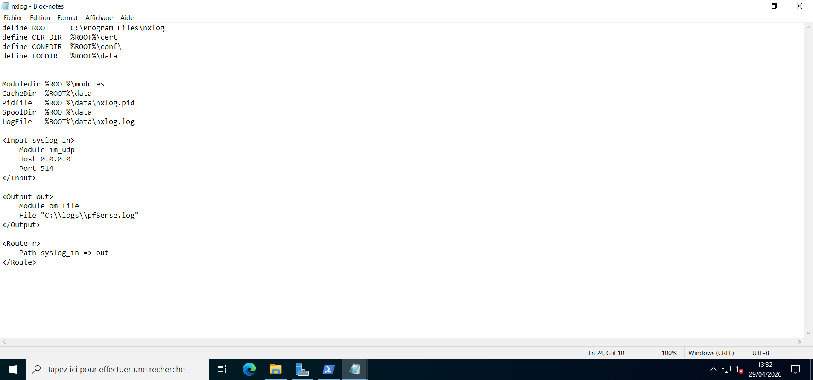

Après installation, le service NXLog a été activé et configuré pour démarrer automatiquement avec le système.

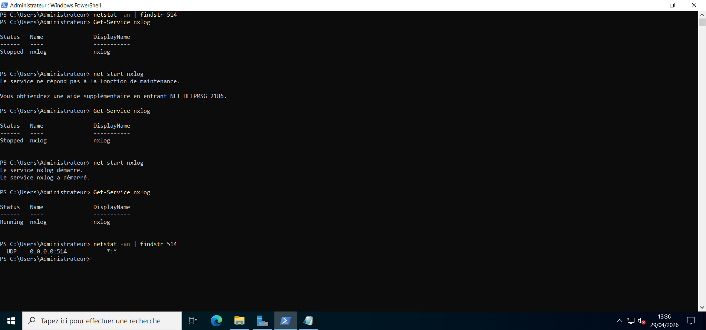

---

### Validation de la réception des journaux

Une fois la communication établie entre pfSense et le serveur de collecte, les journaux réseau sont correctement reçus et enregistrés par NXLog.

Cette validation confirme le bon fonctionnement de la chaîne de collecte des événements réseau.

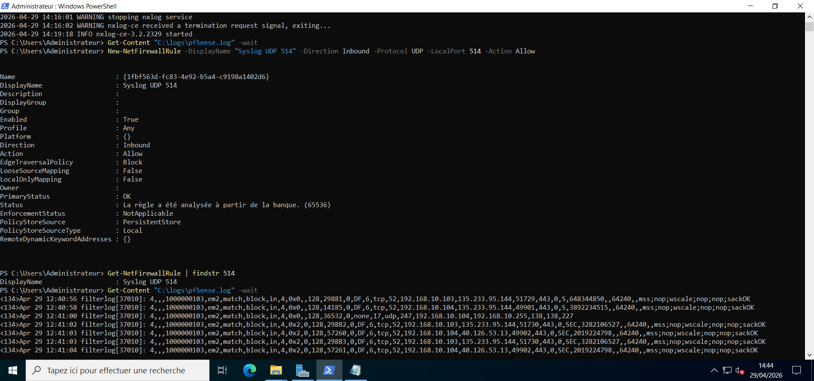

La collecte des événements Windows et des journaux réseau est désormais centralisée sur **ST-FILESERVER01**, offrant un point unique de supervision et d'analyse.

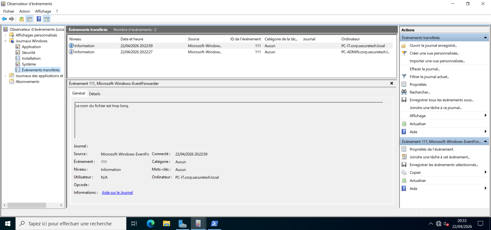

---

## Difficultés rencontrées

La mise en œuvre de cette architecture a nécessité plusieurs phases de dépannage avant d'obtenir une collecte entièrement fonctionnelle.

Les principaux problèmes rencontrés ont été :

- configuration initiale incomplète de WinRM ;
- application tardive des stratégies de groupe ;
- erreurs de configuration de Windows Event Forwarding ;
- mauvaise configuration des règles NXLog ;
- absence de certains modules requis dans NXLog ;
- vérification de l'ouverture des flux réseau nécessaires.

Chaque anomalie a été analysée à l'aide des journaux système, des commandes PowerShell ainsi que des outils de diagnostic Windows.

Les différentes corrections ont permis d'obtenir une infrastructure de collecte stable et entièrement opérationnelle.

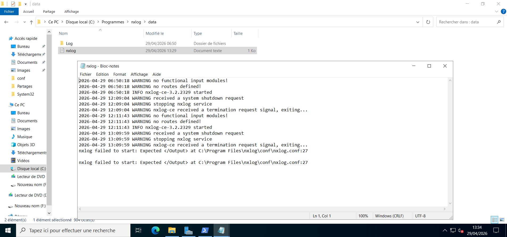

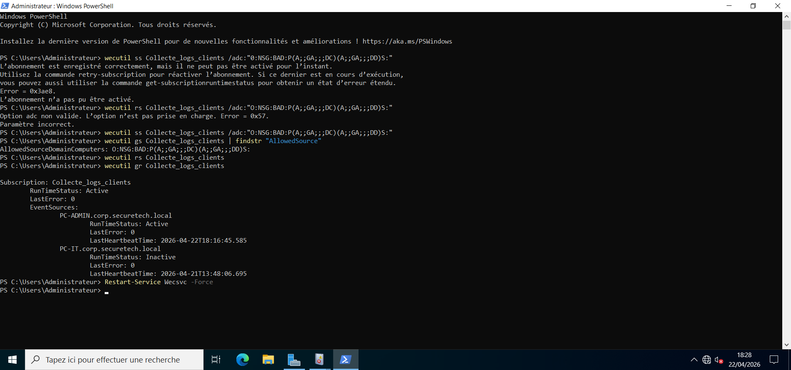

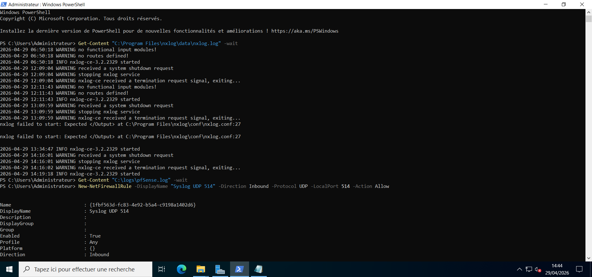

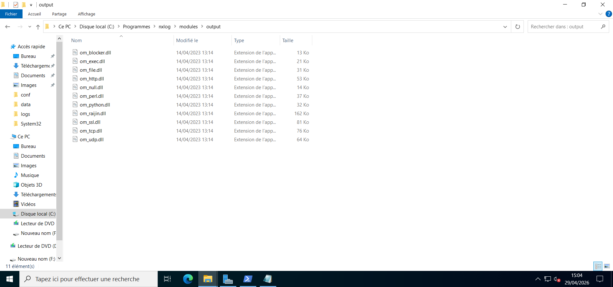

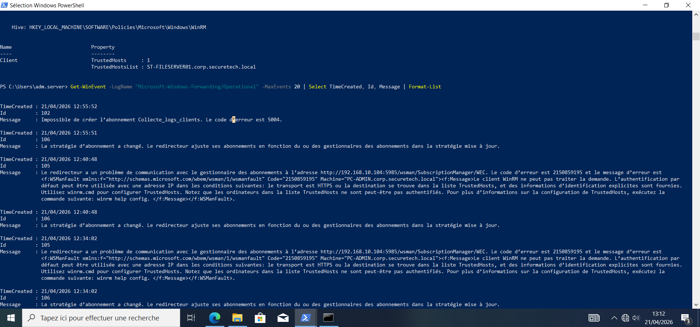

---

## Résultats obtenus

Le déploiement de Windows Event Forwarding (WEF) a permis de mettre en place une infrastructure de journalisation centralisée, offrant une visibilité complète sur les événements générés par les différents composants du laboratoire.

Les objectifs définis au début du projet ont été atteints :

- centralisation des événements Windows sur un serveur unique ;
- collecte automatique des journaux via Windows Event Forwarding ;
- déploiement automatisé de la configuration grâce aux stratégies de groupe (GPO) ;
- communication sécurisée entre les postes clients, les serveurs et le collecteur via WinRM ;
- centralisation des journaux réseau provenant de pfSense grâce à Syslog et NXLog ;
- amélioration de la visibilité sur les activités des utilisateurs, des serveurs et des équipements réseau ;
- réduction du temps nécessaire à l'analyse des incidents ;
- préparation de l'infrastructure à une future intégration avec une plateforme SIEM.

Les principaux événements désormais centralisés comprennent notamment :

- authentifications réussies et échouées ;
- événements Kerberos ;
- connexions RDP ;
- événements Windows Defender ;
- erreurs système ;
- événements applicatifs ;
- journaux du pare-feu pfSense ;
- journaux NAT et DHCP.

La centralisation de ces informations constitue un point d'entrée unique pour les opérations de supervision et d'investigation.

---

## Bénéfices pour l'infrastructure

La mise en œuvre de cette architecture apporte plusieurs avantages opérationnels :

- amélioration de la visibilité sur l'ensemble de l'infrastructure ;
- simplification des investigations lors d'un incident ;
- réduction du temps de diagnostic ;
- corrélation facilitée entre les événements Windows et les événements réseau ;
- centralisation des journaux de sécurité ;
- préparation à l'intégration d'outils de détection avancés.

Cette approche répond aux bonnes pratiques d'administration des systèmes d'information modernes où les événements sont centralisés avant d'être exploités par une plateforme de supervision ou un SIEM.

---

## Perspectives d'évolution

Cette infrastructure constitue une base solide pour les prochaines évolutions du laboratoire **Enterprise Network Security Lab**.

Plusieurs améliorations pourront être intégrées afin d'enrichir les capacités de détection et d'analyse, notamment :

- intégration de **Suricata** afin de centraliser les alertes IDS/IPS ;
- mise en œuvre d'une plateforme **SIEM** telle que Wazuh ou Splunk ;
- création de tableaux de bord de supervision dédiés aux événements de sécurité ;
- corrélation automatique entre les journaux Windows, les événements Active Directory et les alertes réseau ;
- génération d'alertes en temps réel lors de la détection d'activités suspectes.

Ces évolutions permettront de rapprocher davantage le laboratoire d'une architecture SOC utilisée en environnement professionnel.

---

## Conclusion

La mise en place de **Windows Event Forwarding (WEF)**, **Windows Event Collector (WEC)**, **WinRM**, **NXLog** et **Syslog** a permis de construire une plateforme de journalisation centralisée conforme aux bonnes pratiques d'administration système.

Au-delà de la simple collecte des événements, ce projet a nécessité la configuration de plusieurs composants complémentaires, l'automatisation du déploiement via les stratégies de groupe ainsi que la résolution de différents problèmes techniques liés à WinRM, Windows Event Forwarding et NXLog.

L'infrastructure obtenue offre désormais un point unique de collecte des événements Windows et réseau, facilitant la supervision, les investigations et les futures évolutions vers une plateforme de détection plus avancée.

Ce module constitue une étape importante dans la construction du laboratoire **Enterprise Network Security Lab** et renforce les capacités de supervision et d'analyse de l'ensemble de l'infrastructure.
