# Déploiement d'une plateforme de supervision avec Zabbix

## Présentation

La supervision constitue un pilier essentiel du maintien en conditions opérationnelles d'une infrastructure informatique. Elle permet de suivre en temps réel l'état des équipements, d'anticiper les défaillances et de réduire le temps d'interruption des services grâce à une détection proactive des incidents.

Dans le cadre du projet **SecureTech**, une plateforme de supervision basée sur **Zabbix 6.0 LTS** a été déployée afin de centraliser la surveillance des serveurs, du pare-feu et des postes de travail composant l'infrastructure de l'entreprise.

Cette solution permet de collecter les métriques système, de superviser les services critiques, de générer des alertes automatiques et d'informer immédiatement l'administrateur lorsqu'un incident est détecté.

---

# Objectifs

Les objectifs de cette implémentation sont les suivants :

- Déployer une plateforme de supervision centralisée.
- Superviser les équipements critiques de l'infrastructure.
- Assurer la disponibilité des services informatiques.
- Collecter en temps réel les métriques système.
- Détecter automatiquement les anomalies grâce aux Triggers.
- Mettre en place un système d'alertes automatiques par courrier électronique.
- Réduire le temps de détection et de prise en charge des incidents.

---

# Environnement technique

| Composant | Version |
|-----------|---------|
| Zabbix Server | 6.0 LTS |
| Système d'exploitation | Ubuntu Server 22.04 LTS |
| Contrôleur de domaine | Windows Server 2022 |
| Pare-feu | pfSense |
| Messagerie | Gmail SMTP |
| Authentification | Mot de passe d'application Google |

---

# Infrastructure supervisée

La plateforme de supervision couvre l'ensemble des composants critiques du laboratoire SecureTech.

| Equipement | Mode de supervision |
|------------|---------------------|
| Serveur Zabbix | Zabbix Agent |
| Contrôleur de domaine | Zabbix Agent |
| Serveur de fichiers | Zabbix Agent |
| Serveur WSUS | Zabbix Agent |
| Pare-feu pfSense | Zabbix Agent |
| Poste RH | Zabbix Agent |
| Poste IT | Zabbix Agent |
| Poste Finance | Zabbix Agent |

Les agents Zabbix déployés sur les différents systèmes remontent automatiquement les informations de supervision vers le serveur Zabbix afin d'assurer une visibilité centralisée de l'ensemble de l'infrastructure.

---

# Architecture de supervision

La figure suivante présente la cartographie complète de l'infrastructure supervisée.

- Carte de supervision Zabbix

Cette vue permet de visualiser rapidement l'état des différents équipements supervisés ainsi que leur disponibilité au sein de l'infrastructure.

---

# Déploiement de la plateforme

Le déploiement de la plateforme de supervision a été réalisé progressivement afin de garantir un fonctionnement stable de chaque composant avant l'intégration des équipements.

Les principales étapes réalisées sont les suivantes :

- Installation du serveur Zabbix.
- Configuration initiale de la plateforme.
- Création des groupes d'hôtes.
- Ajout des équipements à superviser.
- Déploiement des agents Zabbix.
- Vérification de la communication entre les agents et le serveur.
- Mise en place des tableaux de bord.
- Création des déclencheurs.
- Configuration des notifications par courrier électronique.

---

## Installation du serveur Zabbix

La première étape consiste à installer le serveur Zabbix sur Ubuntu Server puis à effectuer la configuration initiale de la plateforme.

> Installation du serveur

![Installation]../screenshots/configuration/monitoring/01-install-zabbix.png)

Une fois l'installation terminée, l'assistant de configuration permet de finaliser les paramètres de connexion à la base de données ainsi que la configuration générale du serveur.

> Configuration initiale

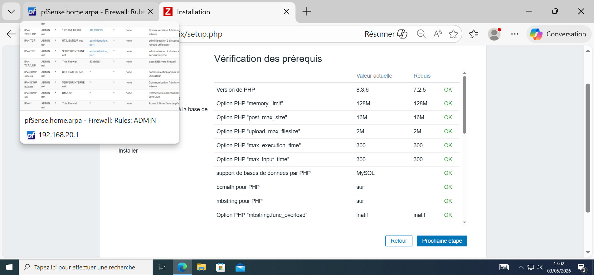

L'installation est ensuite validée par l'accès à l'interface Web de Zabbix.

---

## Organisation des hôtes

Avant l'intégration des équipements, les groupes d'hôtes ont été créés afin de structurer la supervision selon les différents rôles présents dans l'infrastructure.

Cette organisation facilite l'administration, l'application des modèles (Templates) ainsi que la gestion des alertes.

> Création des groupes

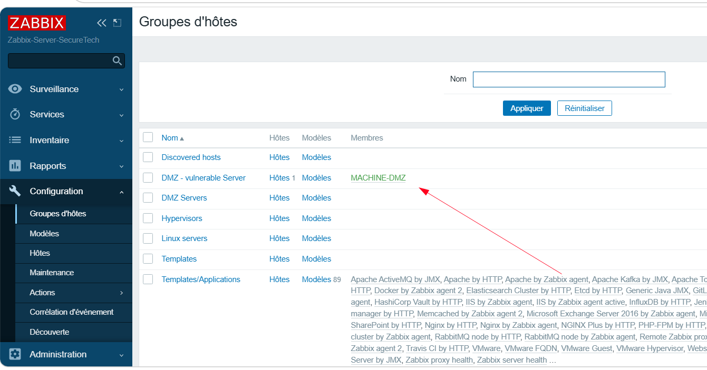

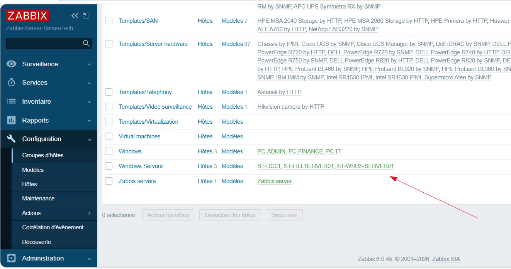

Une fois cette étape terminée, l'infrastructure est prête à recevoir les différents équipements qui seront supervisés par Zabbix.

## Ajout des hôtes

Après le déploiement du serveur Zabbix, l'étape suivante a consisté à intégrer les différents équipements de l'infrastructure au sein de la plateforme de supervision.

Chaque équipement a été enregistré comme un hôte (Host) en associant son adresse IP, son groupe d'appartenance ainsi que le modèle (Template) correspondant à son système d'exploitation.

Cette organisation permet d'administrer efficacement les équipements supervisés tout en facilitant l'application des règles de supervision.

### Intégration du pare-feu pfSense

Le pare-feu pfSense constitue l'élément central de l'architecture réseau. Sa supervision permet de suivre en permanence sa disponibilité ainsi que ses performances.

La configuration de l'hôte comprend notamment :

- l'adresse IP de gestion ;
- l'interface de supervision ;
- le groupe d'hôtes ;
- le modèle **FreeBSD by Zabbix agent**.

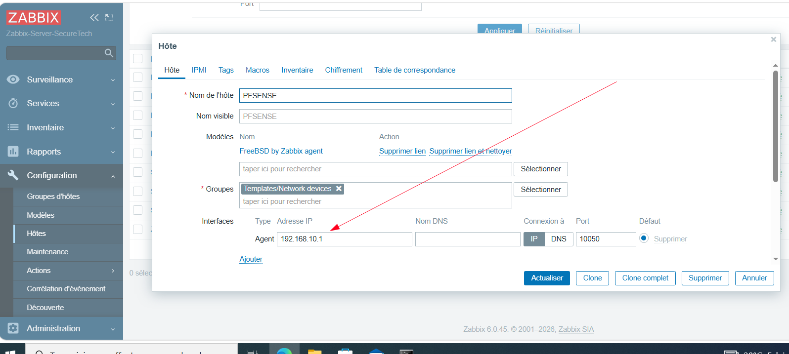

Une fois la configuration terminée, le pare-feu est ajouté à la plateforme et devient disponible pour la collecte des métriques.

---

## Déploiement des agents Zabbix

La collecte des informations de supervision repose sur le déploiement du **Zabbix Agent** sur l'ensemble des systèmes à superviser.

L'agent assure la remontée des métriques vers le serveur Zabbix afin de permettre une surveillance continue de l'état des équipements.

Le service est installé puis configuré avec les paramètres du serveur de supervision.

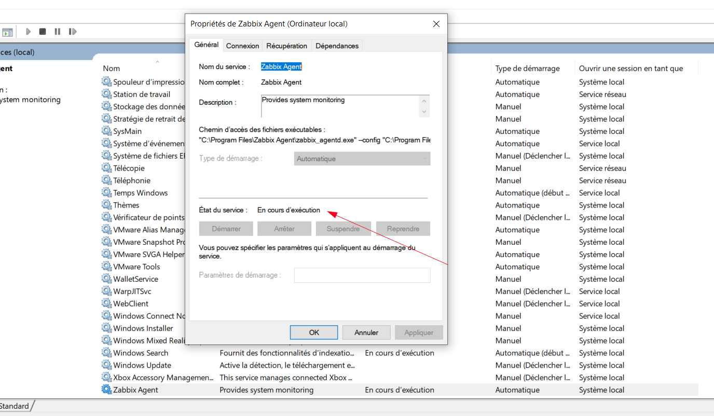

Le fichier de configuration est ensuite adapté afin de définir le serveur Zabbix autorisé, le nom de l'hôte ainsi que les paramètres de communication.

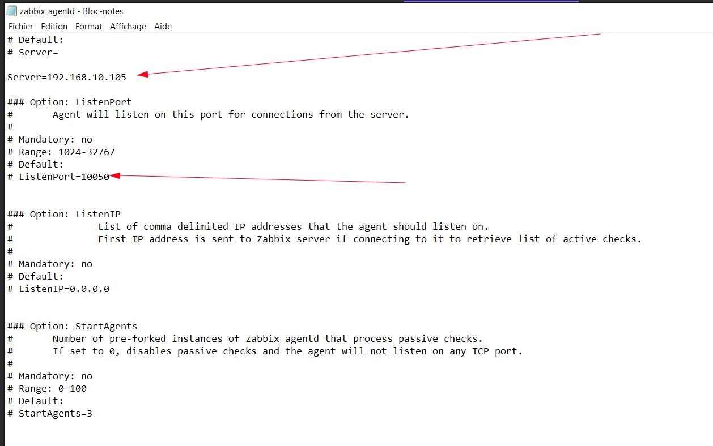

Après le redémarrage du service, la communication entre l'agent et le serveur est validée depuis l'interface Web.

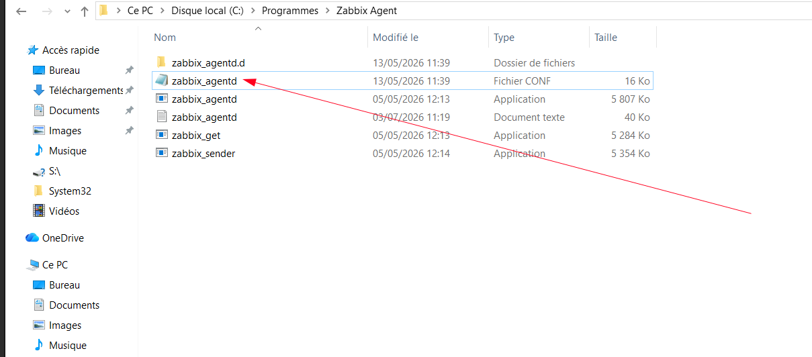

---

## Vérification de la supervision

Une fois les premiers équipements intégrés, Zabbix commence à collecter automatiquement les métriques système.

Le tableau de bord permet de vérifier la disponibilité des hôtes, les incidents détectés ainsi que l'état général de l'infrastructure.

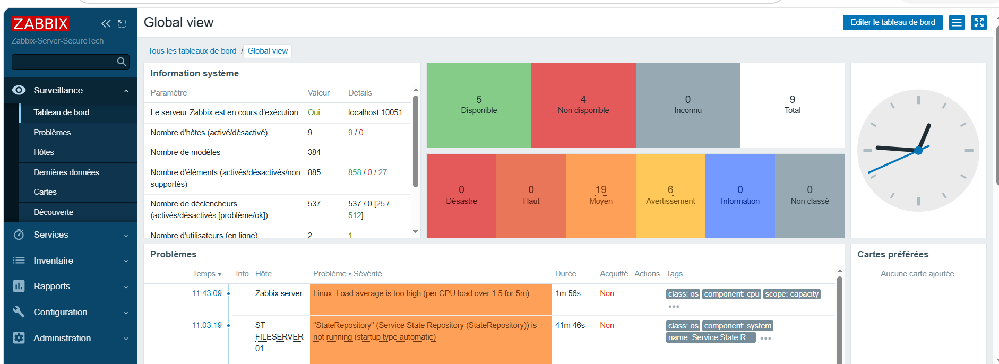

Une seconde vue permet d'obtenir davantage de détails sur les événements remontés par la plateforme.

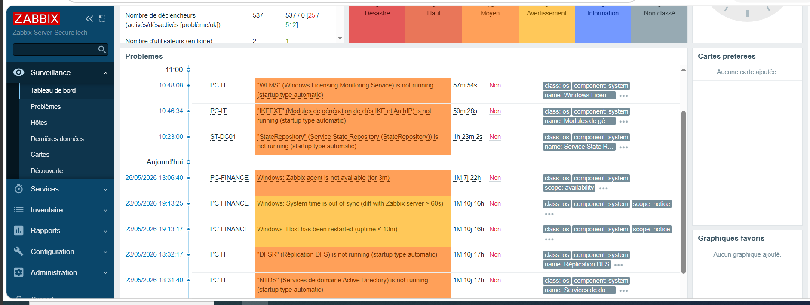

Les premiers résultats confirment le bon fonctionnement de la communication entre les agents et le serveur Zabbix, garantissant ainsi une supervision centralisée de l'infrastructure.

## Supervision des équipements

Une fois les agents déployés et les différents équipements enregistrés, Zabbix commence automatiquement la collecte des métriques système. Les données sont centralisées sur le serveur de supervision afin d'offrir une vision globale de l'état de l'infrastructure.

Les informations remontées permettent notamment de suivre :

- la disponibilité des hôtes ;
- l'utilisation du processeur (CPU) ;
- l'utilisation de la mémoire vive (RAM) ;
- l'occupation des disques ;
- le trafic réseau ;
- le temps de fonctionnement (Uptime) ;
- l'état des principaux services.

Cette supervision continue facilite la détection des anomalies avant qu'elles n'affectent les utilisateurs ou les services de l'entreprise.

---

## Tableau de bord

Le tableau de bord constitue le point central de supervision. Il permet à l'administrateur d'obtenir une vue synthétique de l'ensemble de l'infrastructure, des événements en cours ainsi que des équipements nécessitant une intervention.

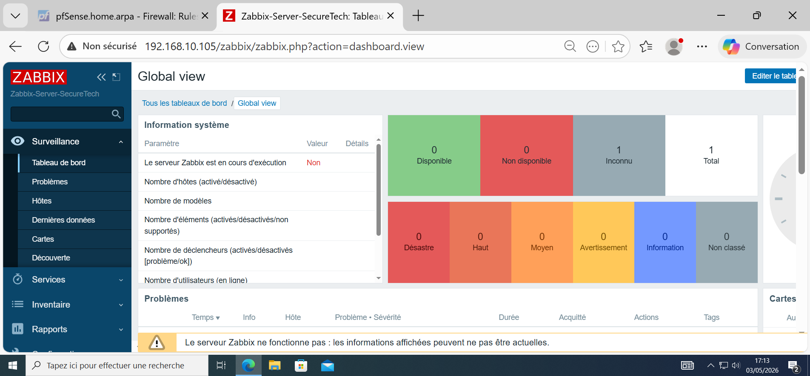

Les widgets permettent d'afficher les événements récents, la disponibilité des hôtes, les incidents ouverts ainsi que les indicateurs de performance les plus importants.

---

## Visualisation des performances

Les graphiques générés automatiquement par Zabbix permettent d'analyser l'évolution des ressources système et de détecter rapidement toute variation inhabituelle.

### Utilisation du processeur

Le suivi de la charge processeur permet d'identifier les périodes de forte activité pouvant impacter les performances des serveurs.

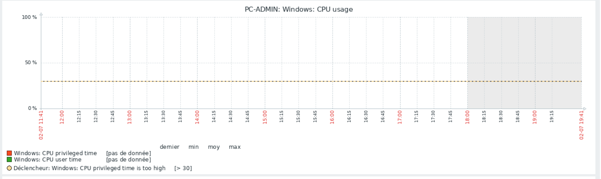

### Utilisation de la mémoire

La supervision de la mémoire permet d'anticiper les situations de saturation susceptibles de dégrader les performances des systèmes.

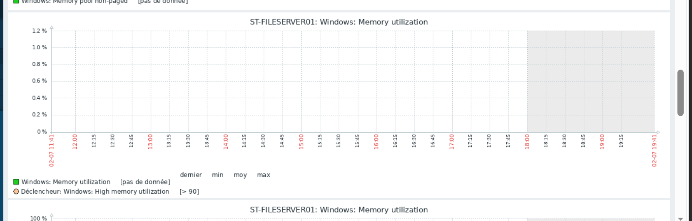

### Utilisation du stockage

Le suivi de l'espace disque permet d'identifier les volumes proches de la saturation et d'intervenir avant toute interruption de service.

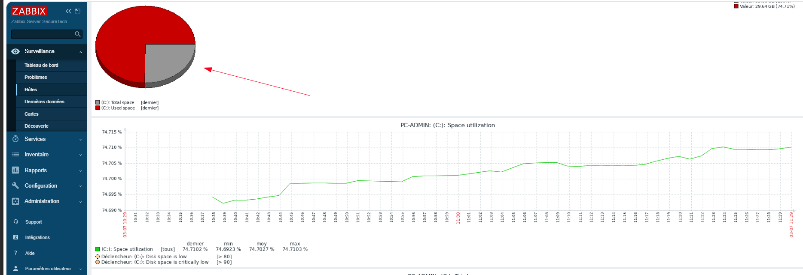

### Trafic réseau

Les graphiques réseau offrent une visibilité sur les volumes de données échangés et facilitent l'identification d'éventuelles anomalies ou pics de trafic.

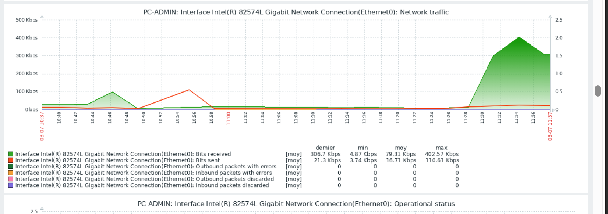

---

## Disponibilité de l'infrastructure

La plateforme contrôle en permanence la disponibilité des différents équipements supervisés. Chaque changement d'état est immédiatement enregistré et présenté à l'administrateur.

Cette surveillance continue constitue la première ligne de détection des incidents et permet de réduire significativement le temps de réaction lors d'une indisponibilité.

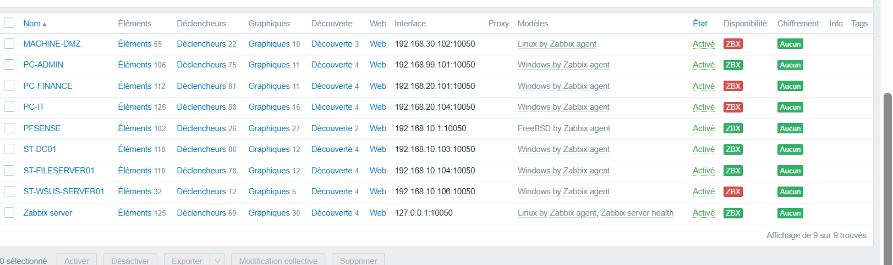

---

## Cartographie de l'infrastructure

Afin de faciliter l'exploitation quotidienne de la plateforme, une carte de supervision a été mise en place. Elle offre une représentation graphique des principaux équipements de l'infrastructure et de leur état de fonctionnement.

Cette vue permet d'identifier rapidement un équipement indisponible et de localiser son emplacement dans l'architecture.

La cartographie complète la supervision classique en apportant une vision globale de l'environnement surveillé et constitue un outil précieux lors des opérations d'exploitation et de diagnostic.

## Intégration des serveurs Windows

Après la mise en place de la plateforme de supervision, les serveurs Windows de l'infrastructure ont été intégrés afin d'assurer une surveillance continue de leur disponibilité et de leurs performances.

Le contrôleur de domaine, le serveur de fichiers ainsi que le serveur WSUS communiquent avec le serveur Zabbix grâce au Zabbix Agent. Cette approche permet de collecter en temps réel les métriques système et d'assurer un suivi permanent des ressources critiques.

### Installation du Zabbix Agent

L'installation du Zabbix Agent constitue la première étape de l'intégration des serveurs Windows à la plateforme de supervision.

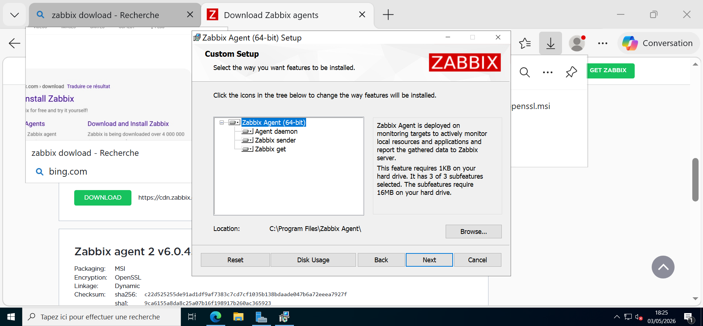

Une fois installé, l'agent est configuré afin d'autoriser les communications avec le serveur Zabbix et d'identifier correctement l'hôte au sein de la plateforme.

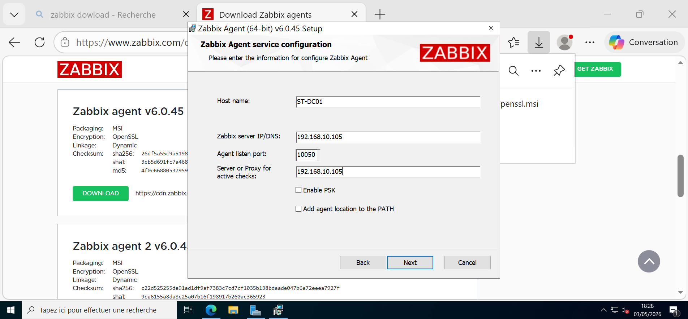

Après validation de la configuration, le serveur apparaît comme disponible dans le tableau de bord.

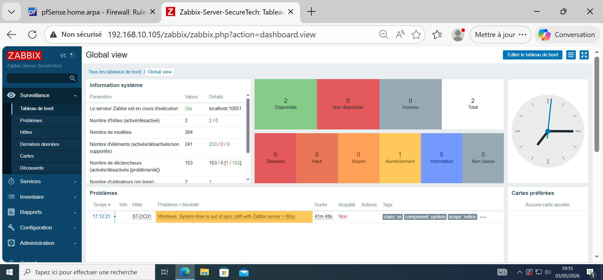

---

## Supervision du pare-feu pfSense

Le pare-feu pfSense représente un composant stratégique de l'infrastructure. Sa supervision permet de contrôler sa disponibilité ainsi que son état de fonctionnement afin d'assurer la continuité des services réseau.

L'intégration repose sur le modèle **FreeBSD by Zabbix Agent**, adapté au système d'exploitation utilisé par pfSense.

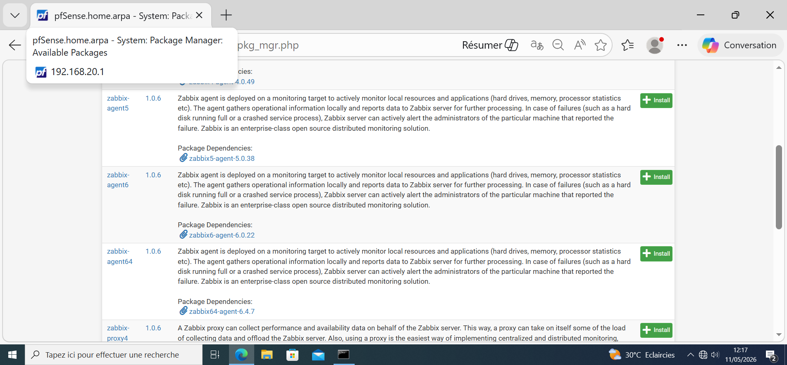

Une fois le pare-feu enregistré, Zabbix commence automatiquement la collecte des informations de supervision.

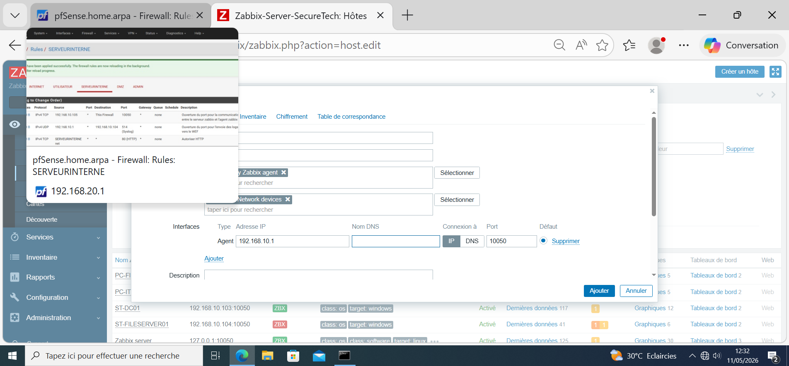

La communication entre le serveur Zabbix et pfSense est ensuite validée afin de garantir une supervision fiable.

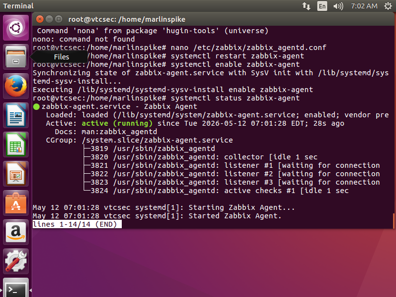

---

## Mise en place des Triggers

Les Triggers constituent le mécanisme de détection des incidents au sein de Zabbix. Ils permettent de définir des conditions de surveillance et de générer automatiquement un événement lorsqu'un seuil critique est atteint.

Dans ce projet, plusieurs déclencheurs ont été configurés afin de superviser les composants essentiels de l'infrastructure.

La création d'un Trigger débute par la définition de la condition à surveiller.

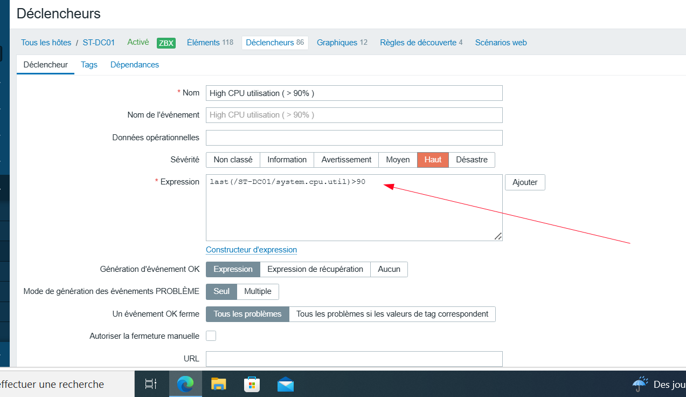

Une fois enregistré, le Trigger devient immédiatement opérationnel.

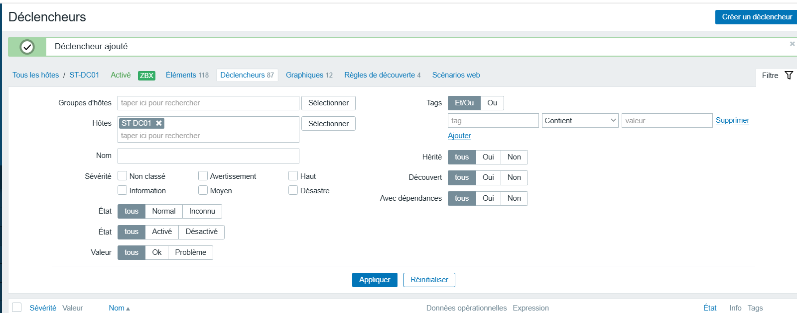

Les premiers tests ont permis de vérifier le bon fonctionnement de la détection des incidents.

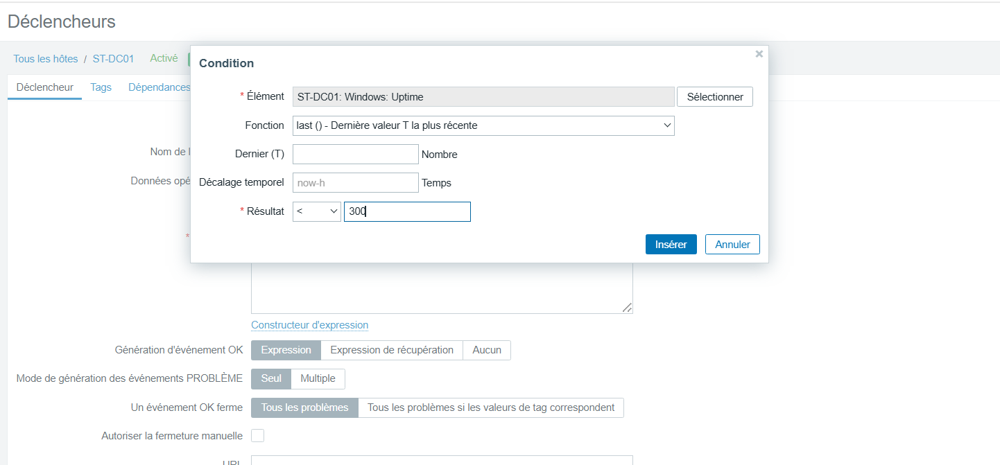

---

## Supervision des ressources système

En complément de la disponibilité des équipements, plusieurs Triggers ont été configurés afin de surveiller l'utilisation des ressources système.

La consommation de la mémoire est contrôlée en permanence afin de détecter toute situation de saturation susceptible d'impacter les performances.

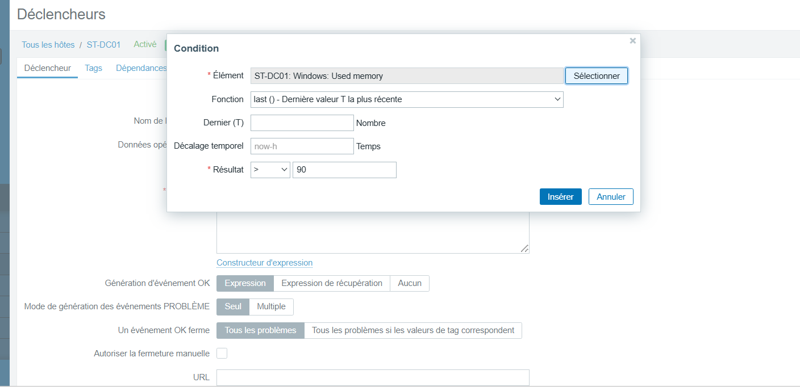

Une alerte est générée dès que le seuil défini est dépassé.

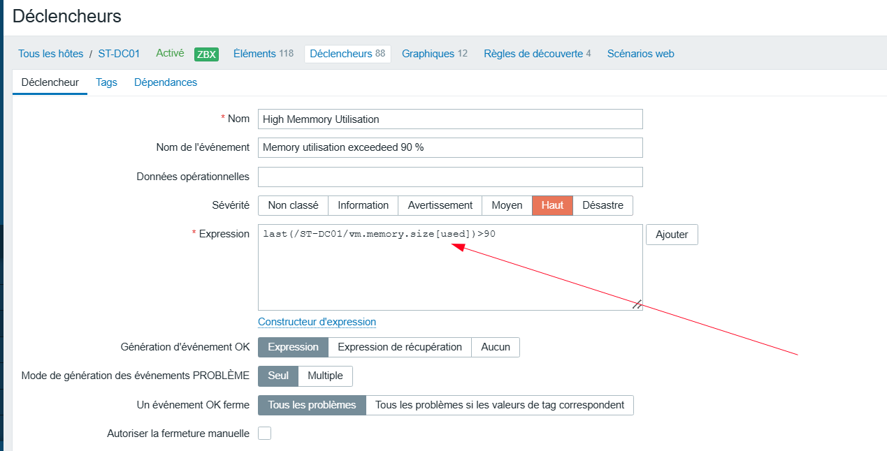

Le redémarrage inattendu d'un serveur constitue également un événement critique nécessitant une intervention rapide.

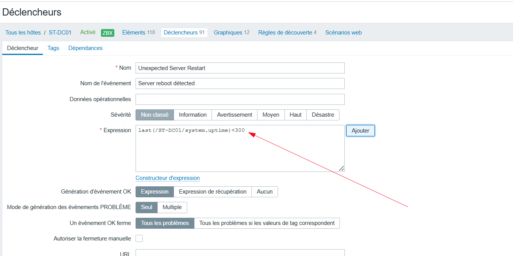

Enfin, la supervision des services Windows permet de détecter automatiquement l'arrêt d'un service essentiel, notamment ceux liés au fonctionnement de l'Active Directory.

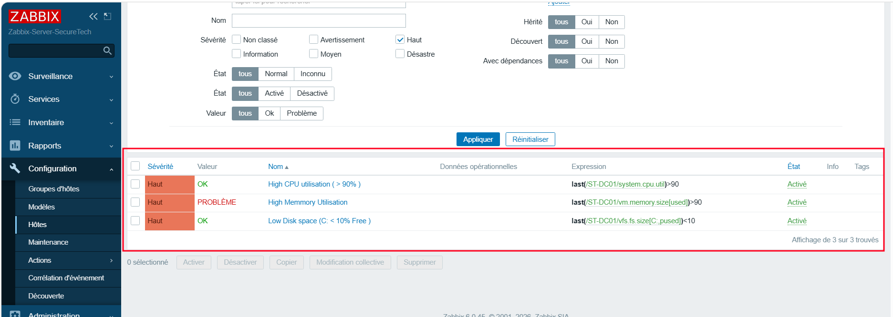

Grâce à cette configuration, la plateforme est désormais capable d'identifier automatiquement les principaux incidents pouvant affecter la disponibilité de l'infrastructure avant qu'ils ne deviennent critiques.
