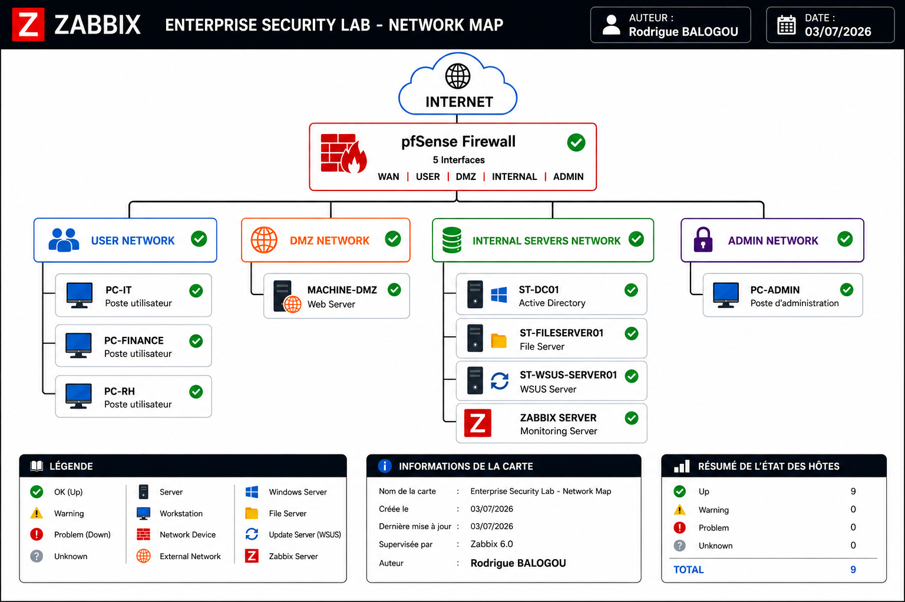

# Déploiement d'une plateforme de supervision avec Zabbix

## Présentation

La supervision constitue un pilier essentiel du maintien en conditions opérationnelles d'une infrastructure informatique. Elle permet de suivre en temps réel l'état des équipements, d'anticiper les défaillances et de réduire le temps d'interruption des services grâce à une détection proactive des incidents.

Dans le cadre du projet **SecureTech**, une plateforme de supervision basée sur **Zabbix 6.0 LTS** a été déployée afin de centraliser la surveillance des serveurs, du pare-feu et des postes de travail composant l'infrastructure de l'entreprise.

Cette solution permet de collecter les métriques système, de superviser les services critiques, de générer des alertes automatiques et d'informer immédiatement l'administrateur lorsqu'un incident est détecté.

---

# Objectifs

Les objectifs de cette implémentation sont les suivants :

- Déployer une plateforme de supervision centralisée.
- Superviser les équipements critiques de l'infrastructure.
- Assurer la disponibilité des services informatiques.
- Collecter en temps réel les métriques système.
- Détecter automatiquement les anomalies grâce aux Triggers.
- Mettre en place un système d'alertes automatiques par courrier électronique.
- Réduire le temps de détection et de prise en charge des incidents.

---

# Environnement technique

| Composant | Version |
|-----------|---------|
| Zabbix Server | 6.0 LTS |
| Système d'exploitation | Ubuntu Server 22.04 LTS |
| Contrôleur de domaine | Windows Server 2022 |
| Pare-feu | pfSense |
| Messagerie | Gmail SMTP |
| Authentification | Mot de passe d'application Google |

---

# Infrastructure supervisée

La plateforme de supervision couvre l'ensemble des composants critiques du laboratoire SecureTech.

| Equipement | Mode de supervision |
|------------|---------------------|
| Serveur Zabbix | Zabbix Agent |
| Contrôleur de domaine | Zabbix Agent |
| Serveur de fichiers | Zabbix Agent |
| Serveur WSUS | Zabbix Agent |
| Pare-feu pfSense | Zabbix Agent |
| Poste RH | Zabbix Agent |
| Poste IT | Zabbix Agent |
| Poste Finance | Zabbix Agent |

Les agents Zabbix déployés sur les différents systèmes remontent automatiquement les informations de supervision vers le serveur Zabbix afin d'assurer une visibilité centralisée de l'ensemble de l'infrastructure.

---

# Architecture de supervision

La figure suivante présente la cartographie complète de l'infrastructure supervisée.

— Carte de supervision Zabbix





Cette vue permet de visualiser rapidement l'état des différents équipements supervisés ainsi que leur disponibilité au sein de l'infrastructure.

---

# Déploiement de la plateforme

Le déploiement de la plateforme de supervision a été réalisé progressivement afin de garantir un fonctionnement stable de chaque composant avant l'intégration des équipements.

Les principales étapes réalisées sont les suivantes :

- Installation du serveur Zabbix.
- Configuration initiale de la plateforme.
- Création des groupes d'hôtes.
- Ajout des équipements à superviser.
- Déploiement des agents Zabbix.
- Vérification de la communication entre les agents et le serveur.
- Mise en place des tableaux de bord.
- Création des déclencheurs.
- Configuration des notifications par courrier électronique.

---

## Installation du serveur Zabbix

La première étape consiste à installer le serveur Zabbix sur Ubuntu Server puis à effectuer la configuration initiale de la plateforme.

> Installation du serveur

```markdown

```

Une fois l'installation terminée, l'assistant de configuration permet de finaliser les paramètres de connexion à la base de données ainsi que la configuration générale du serveur.

> Configuration initiale

```markdown

```

```markdown

```

L'installation est ensuite validée par l'accès à l'interface Web de Zabbix.

---

## Organisation des hôtes

Avant l'intégration des équipements, les groupes d'hôtes ont été créés afin de structurer la supervision selon les différents rôles présents dans l'infrastructure.

Cette organisation facilite l'administration, l'application des modèles (Templates) ainsi que la gestion des alertes.

> Création des groupes

```markdown

```

```markdown

```

Une fois cette étape terminée, l'infrastructure est prête à recevoir les différents équipements qui seront supervisés par Zabbix.
