# pfSense Configuration

# Introduction

Cette section décrit la configuration du pare-feu pfSense déployé dans l’infrastructure SecureTech.

Le firewall joue un rôle central dans l’architecture réseau et assure :

- le routage inter-réseaux,
- le filtrage des communications,
- la segmentation réseau,
- la translation d’adresses (NAT),
- l’attribution des adresses IP via DHCP,
- le contrôle des flux entre les différentes zones de sécurité.

L’objectif de cette configuration est de reproduire une architecture d’entreprise réaliste reposant sur une politique de sécurité stricte et une isolation des segments réseau.

---

# pfSense Dashboard

Le tableau de bord pfSense permet de superviser rapidement l’état général du firewall :

- interfaces réseau,
- utilisation CPU et mémoire,
- état des services,
- passerelles,
- état des connexions.

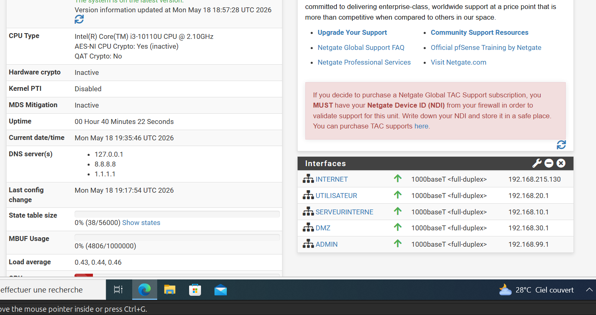

---

# Interface Assignment

Le pare-feu est configuré avec plusieurs interfaces réseau correspondant aux différentes zones de sécurité de l’infrastructure.

Interfaces configurées :

- WAN
- UTILISATEUR
- SERVEURINTERNE
- DMZ
- ADMIN

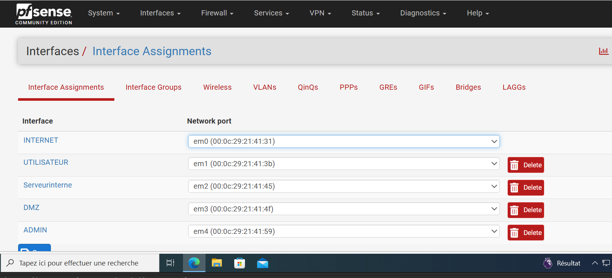

---

# Interface IP Configuration

Chaque interface dispose d’un plan d’adressage dédié permettant une segmentation stricte du réseau.

| Interface | Réseau |
|---|---|
| WAN | DHCP VMware NAT |
| UTILISATEUR | 192.168.20.0/24 |
| SERVEURINTERNE | 192.168.10.0/24 |
| DMZ | 192.168.30.0/24 |
| ADMIN | 192.168.99.0/24 |

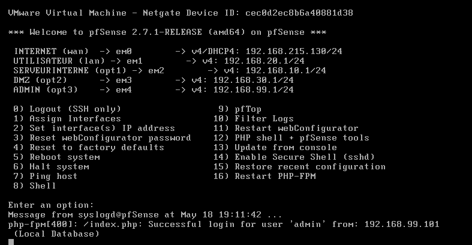

---

# WAN Interface

L’interface WAN est connectée au réseau NAT fourni par VMware Workstation.

Cette interface permet :

- l’accès Internet,
- la publication des services exposés,
- la réception des connexions externes.

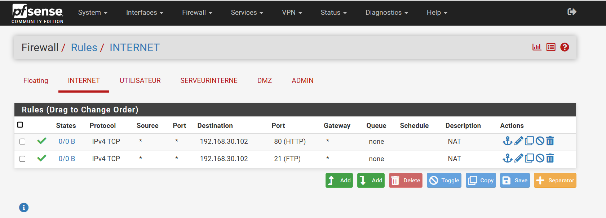

---

# DHCP Configuration

Le serveur DHCP est géré directement par pfSense pour les différents segments réseau.

Cette configuration permet :

- l’attribution automatique des adresses IP,
- la distribution des paramètres réseau,
- la centralisation de la configuration client.

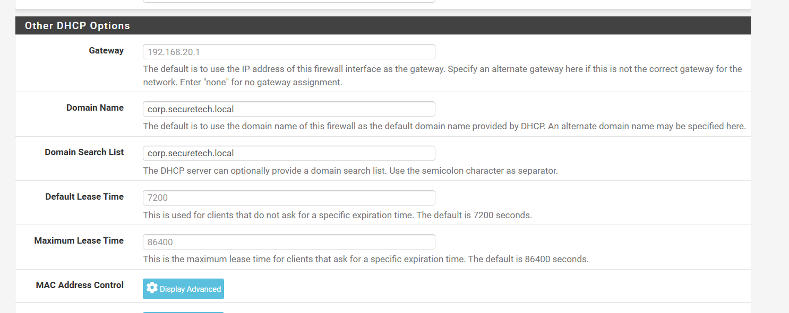

---

# DHCP Leases

Les baux DHCP permettent de visualiser les machines ayant reçu une adresse IP depuis pfSense.

Cette section facilite :

- l’identification des clients,
- la supervision réseau,
- le suivi des équipements connectés.

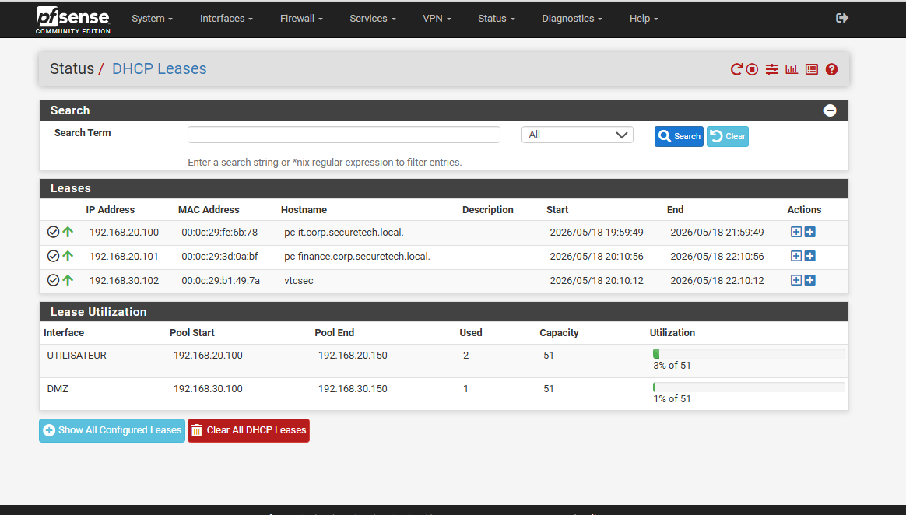

---

# DNS Forwarder Configuration

La résolution DNS interne est assurée par Active Directory.

pfSense intervient comme relais DNS externe grâce au mécanisme de redirection DNS (forwarder).

Cette approche permet :

- un meilleur contrôle du trafic DNS,
- une centralisation des requêtes externes,
- une meilleure visibilité réseau.

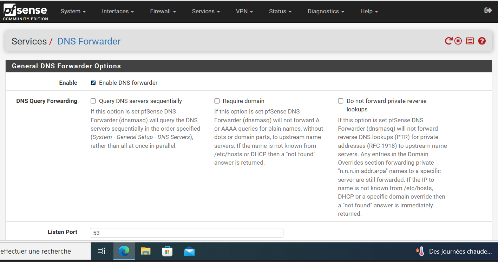

---

# Gateway Configuration

La passerelle WAN permet aux différents réseaux internes d’accéder à Internet.

pfSense utilise cette gateway pour :

- le routage sortant,
- les mises à jour système,
- la publication des services exposés.

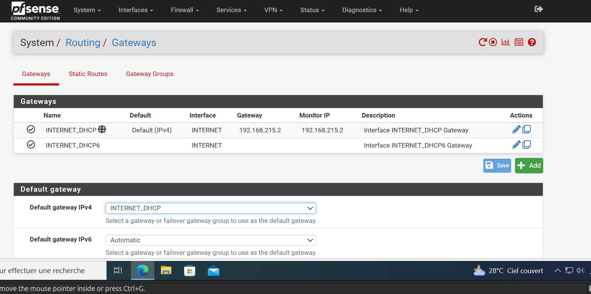

---

# Firewall Aliases

Des alias firewall sont utilisés afin de simplifier la gestion des règles de filtrage.

Cette approche améliore :

- la lisibilité,
- la maintenance,
- l’organisation des politiques réseau.

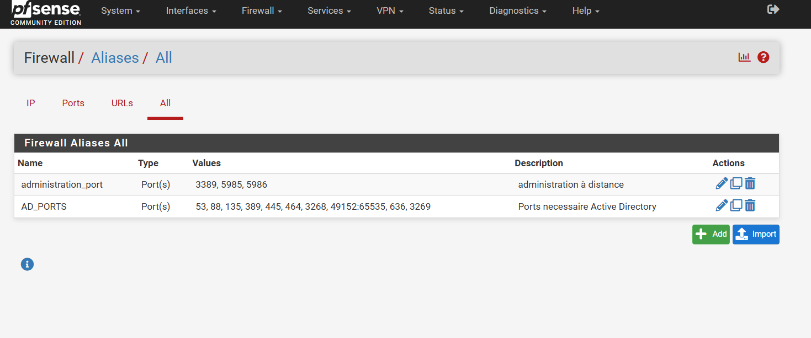

---

# Firewall Policy

La politique de sécurité appliquée repose sur plusieurs principes :

- deny par défaut,
- segmentation stricte,
- moindre privilège,
- isolation des zones sensibles.

Aucune règle permissive globale de type "allow any" n’est utilisée.

---

# User Network Rules

Le réseau UTILISATEUR dispose uniquement des accès nécessaires :

- DNS,
- authentification Active Directory,
- HTTPS,
- services essentiels.

Les accès vers les segments sensibles sont bloqués.

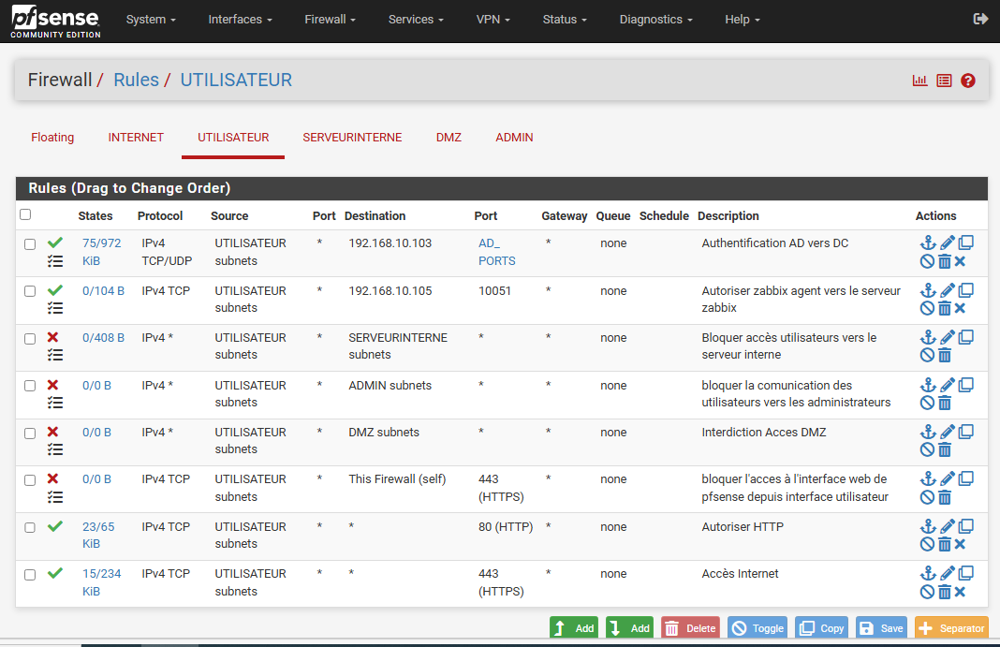

---

# Internal Server Network Rules

Le réseau SERVEURINTERNE héberge les composants critiques de l’infrastructure.

Les communications autorisées sont strictement limitées afin de protéger :

- Active Directory,
- DNS,
- les services internes.

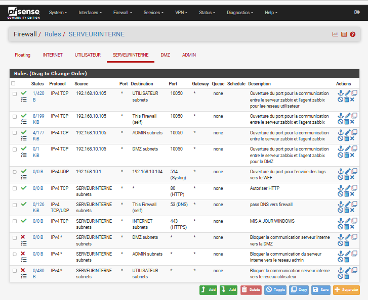

---

# DMZ Network Rules

La DMZ contient les services exposés vers Internet.

Cette zone est isolée des réseaux internes afin d’empêcher tout mouvement latéral en cas de compromission.

---

# Administration Network Rules

Le réseau ADMIN est réservé aux opérations d’administration.

Depuis ce segment, les administrateurs peuvent :

- gérer les serveurs,
- administrer les équipements,
- accéder à l’interface pfSense.

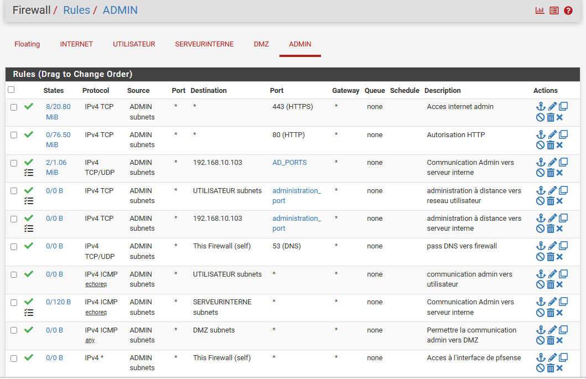

---

# Admin Access Restriction

L’accès à l’interface d’administration pfSense est limité au réseau ADMIN.

Cette restriction protège le firewall contre les accès non autorisés.

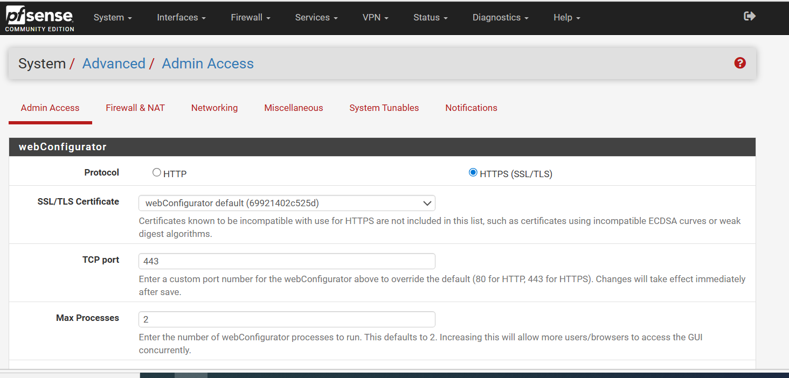

---

# NAT Configuration

Le NAT est configuré afin de permettre aux réseaux internes d’accéder à Internet.

pfSense assure automatiquement la translation d’adresses pour les différents segments réseau.

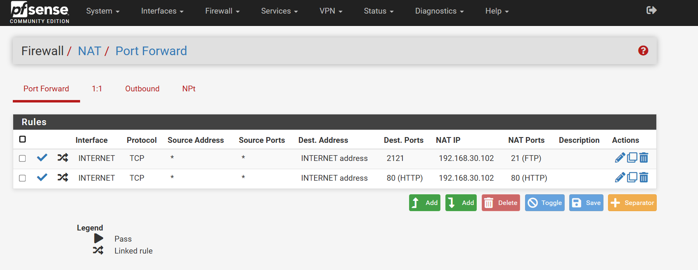

---

# Port Forwarding

Des règles de redirection de ports sont utilisées afin d’exposer certains services hébergés dans la DMZ.

Services publiés :

- HTTP (80)
- FTP (2121)

Destination :

- 192.168.30.102

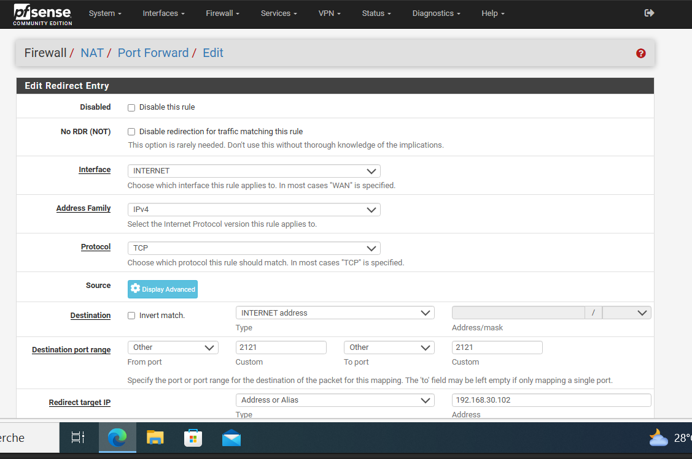

---

# NAT Reflection

La réflexion NAT permet aux machines internes d’accéder aux services publiés en utilisant l’adresse WAN.

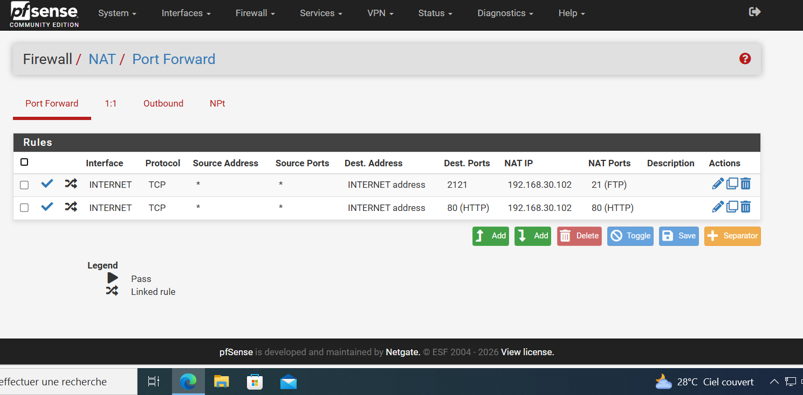

---

# Firewall Logs

La journalisation est activée sur les règles critiques afin de surveiller :

- les connexions entrantes,
- les flux bloqués,
- les tentatives d’accès non autorisées.

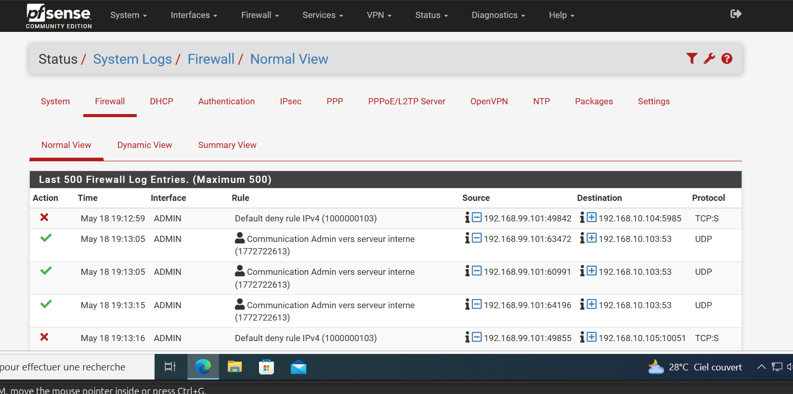

---

# Default Deny Behavior

La politique de sécurité applique un blocage implicite de tout trafic non explicitement autorisé.

Cette approche permet de réduire fortement la surface d’attaque.

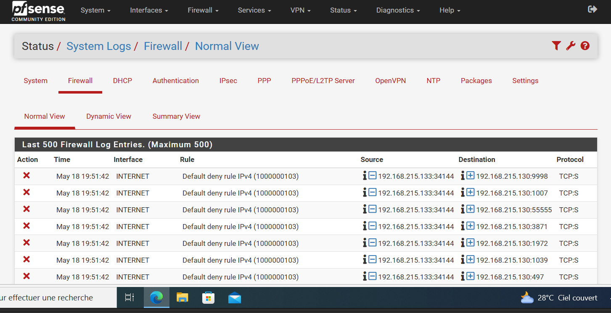

---

# State Table

La table d’état permet de visualiser les connexions actives traversant le firewall.

Elle facilite :

- l’analyse réseau,
- le dépannage,
- la supervision des flux.

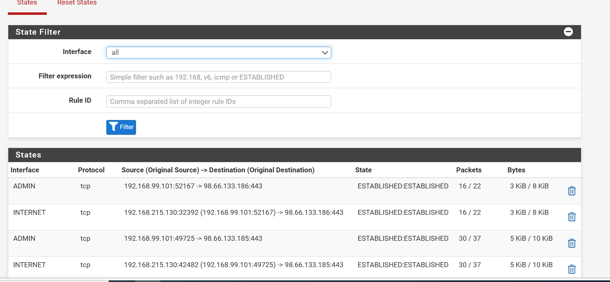

---

# Security Principles

L’architecture pfSense applique plusieurs principes de sécurité :

- segmentation réseau,
- isolation des services exposés,
- contrôle strict des communications,
- protection du réseau d’administration,
- limitation des mouvements latéraux.

---

# Current Limitations

Certaines améliorations restent possibles :

- mise en place d’un IDS/IPS,
- NAT hybride ou manuel,
- filtrage géographique,
- limitation WAN par IP source,
- haute disponibilité firewall.

---

# Conclusion

Le pare-feu pfSense constitue le point central de sécurité de l’infrastructure SecureTech.

Il assure :

- la segmentation réseau,
- le contrôle des flux,
- l’isolation des services exposés,
- la protection des ressources critiques.

Cette configuration fournit une base solide pour des scénarios avancés de cybersécurité offensive et défensive.
