# Suricata - Intrusion Detection and Prevention System (IDS/IPS)

## Présentation

Dans une infrastructure d'entreprise, le pare-feu constitue la première ligne de défense en contrôlant les flux réseau autorisés ou interdits. Cependant, il ne permet pas toujours d'identifier les comportements malveillants ou les tentatives d'intrusion dissimulées dans un trafic autorisé.

Afin d'améliorer la visibilité sur les événements de sécurité, un système **IDS/IPS (Intrusion Detection and Prevention System)** a été intégré au laboratoire à l'aide de **Suricata**, déployé directement sur le pare-feu **pfSense**.

L'objectif de cette mise en œuvre n'était pas uniquement d'installer un IDS, mais de comprendre son fonctionnement, de maîtriser sa configuration, d'analyser les alertes générées et de valider son efficacité face à plusieurs scénarios d'attaque reproduisant des situations réalistes.

---

## Objectifs

Cette partie du laboratoire poursuit plusieurs objectifs techniques :

- Comprendre le fonctionnement d'un IDS et d'un IPS.
- Déployer Suricata sur pfSense.
- Configurer un moteur de détection basé sur les signatures Emerging Threats Open.
- Surveiller le trafic entrant vers l'infrastructure.
- Détecter différentes attaques réseau.
- Tester les mécanismes de blocage automatique.
- Comprendre les différences entre le mode IDS et le mode IPS.
- Documenter l'ensemble du processus de déploiement.

---

## Architecture de déploiement

Suricata est installé directement sur le pare-feu **pfSense**, point de passage obligatoire des communications entre Internet et les différents segments du laboratoire.

Les interfaces protégées sont :

- **WAN** : surveillance des attaques provenant d'Internet.
- **DMZ** : surveillance des serveurs exposés.

Les autres réseaux internes sont principalement supervisés à l'aide de **Zabbix**, ce qui explique le choix de concentrer Suricata sur les zones les plus exposées aux attaques.

Cette approche est proche de celle adoptée dans de nombreuses infrastructures d'entreprise où l'IDS est positionné au niveau du périmètre réseau.

---

# Installation de Suricata

## Installation du package

Le package Suricata a été installé depuis le gestionnaire de paquets intégré à pfSense.

Cette installation ajoute les fonctionnalités nécessaires à l'analyse approfondie des paquets réseau ainsi qu'au téléchargement des bases de signatures utilisées pour identifier les activités malveillantes.

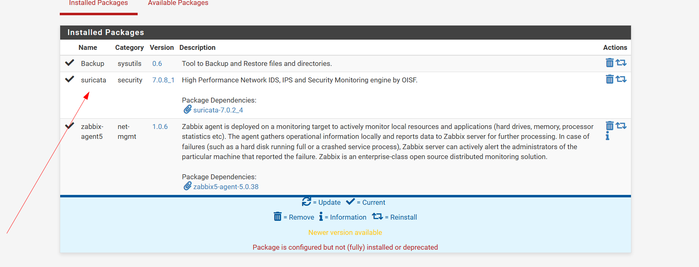

---

## Configuration globale

Après l'installation, les paramètres globaux de Suricata ont été configurés.

Cette étape prépare notamment :

- le téléchargement automatique des signatures ;
- la mise à jour des règles ;
- le fonctionnement général du moteur de détection.

Une configuration correcte garantit que les signatures restent régulièrement mises à jour afin de détecter les menaces les plus récentes.

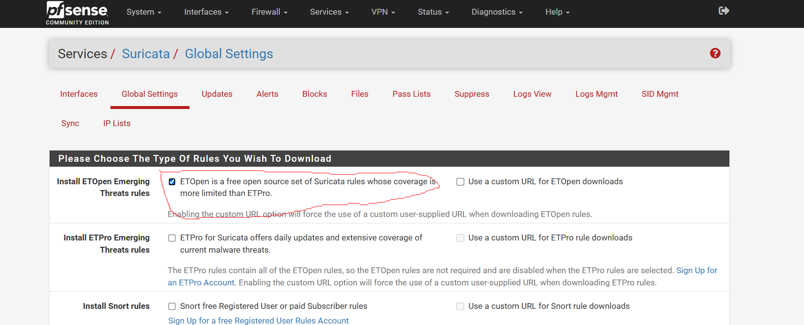

---

# Configuration des interfaces

Deux interfaces ont été configurées pour être protégées par Suricata.

## Interface WAN

L'interface WAN est la principale porte d'entrée des connexions provenant de l'extérieur.

Le déploiement de Suricata sur cette interface permet de détecter rapidement :

- les scans de ports ;
- les tentatives de reconnaissance ;
- les connexions suspectes ;
- certaines attaques automatisées.

## Interface DMZ

La DMZ héberge les services accessibles depuis l'extérieur.

Cette interface représente une cible privilégiée pour un attaquant. Son analyse permet de détecter rapidement toute activité anormale visant les serveurs exposés.

Le choix de protéger simultanément le WAN et la DMZ permet d'obtenir une meilleure visibilité sur les attaques provenant d'Internet avant qu'elles n'atteignent les ressources internes.

---

## Détection d'intrusion

Une fois l'interface créée, le moteur de détection est activé.

Cette configuration permet à Suricata d'inspecter chaque paquet réseau traversant l'interface sélectionnée afin de le comparer aux signatures disponibles.

L'objectif est de détecter les comportements correspondant à des attaques connues sans modifier le trafic réseau lorsque Suricata fonctionne en mode IDS.

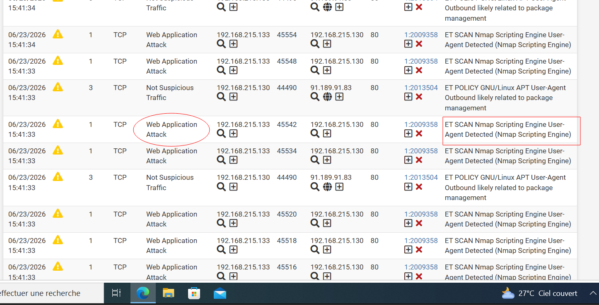

---

# Configuration du réseau protégé

## Définition de HOME_NET

La variable **HOME_NET** représente le réseau considéré comme fiable par Suricata.

Cette information est utilisée par les signatures afin de distinguer les communications internes des communications provenant de l'extérieur.

Une définition correcte de cette variable améliore considérablement la précision des alertes générées.

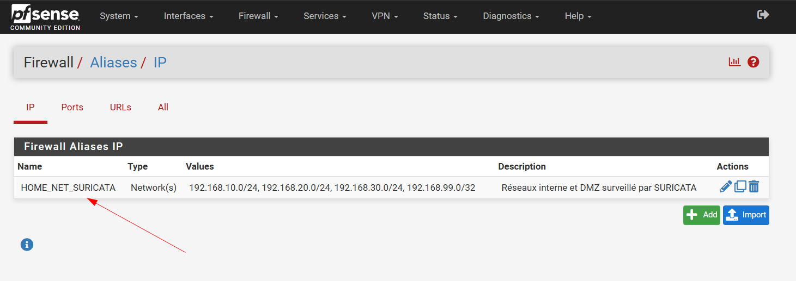

# Configuration des règles de détection

## Téléchargement des signatures

Suricata s'appuie sur des bases de signatures afin d'identifier les comportements malveillants présents dans le trafic réseau.

Dans ce laboratoire, les signatures **Emerging Threats Open (ET Open Rules)** ont été utilisées. Ce choix permet de bénéficier d'une base de règles libre, régulièrement mise à jour et largement utilisée dans les environnements professionnels.

Après la configuration du serveur de mise à jour, un premier téléchargement des signatures a été effectué avec succès.

Cette étape garantit que le moteur de détection dispose des signatures les plus récentes avant le début des tests.

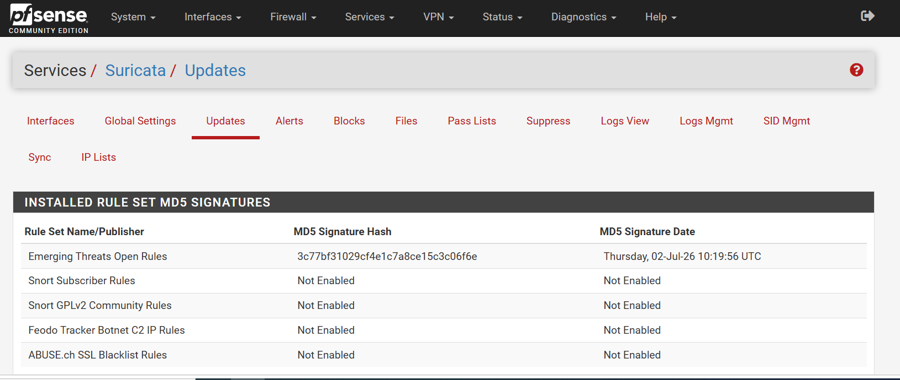

---

## Sélection des catégories

Toutes les catégories ne sont pas utiles dans un laboratoire ou dans une infrastructure de production.

Une sélection des catégories les plus pertinentes a donc été réalisée afin de couvrir les principales menaces susceptibles de cibler le laboratoire.

Les catégories activées permettent notamment de détecter :

- les scans réseau ;
- les tentatives d'exploitation ;
- les logiciels malveillants ;
- les communications avec des serveurs de commande (C2) ;
- les attaques Web ;
- les activités suspectes sur différents protocoles.

L'activation ciblée des catégories permet également de limiter les faux positifs tout en conservant un niveau de détection élevé.

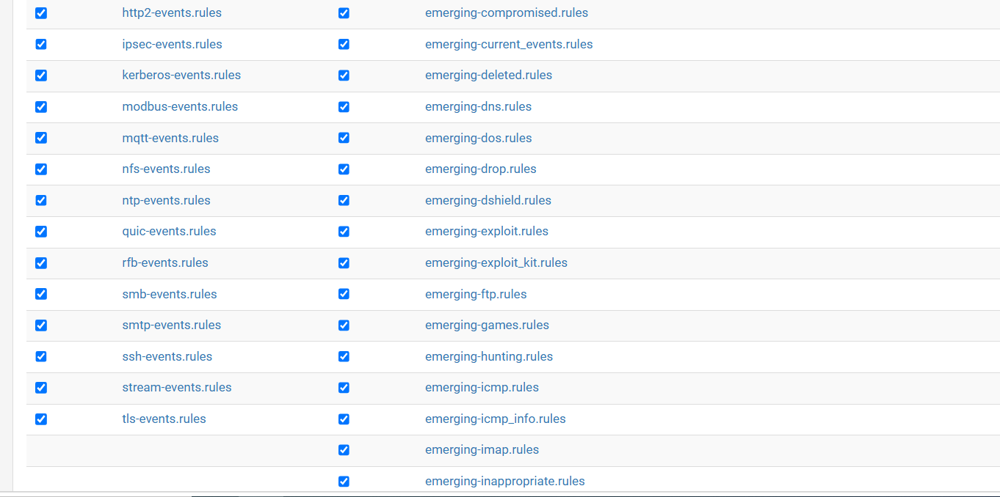

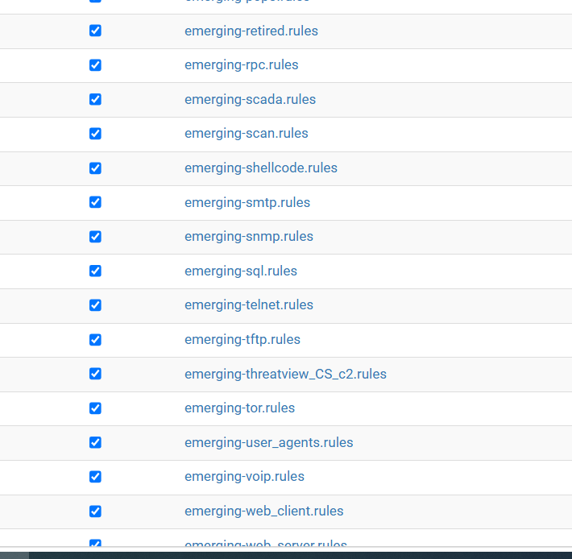

---

# Configuration des alertes

Une fois les règles activées, Suricata commence à analyser le trafic traversant les interfaces protégées.

Chaque événement correspondant à une signature génère une alerte contenant plusieurs informations :

- date et heure ;
- adresse IP source ;
- adresse IP destination ;
- protocole ;
- priorité ;
- signature déclenchée ;
- identifiant GID:SID.

Ces informations facilitent l'analyse des incidents et permettent d'identifier rapidement l'origine d'une activité suspecte.

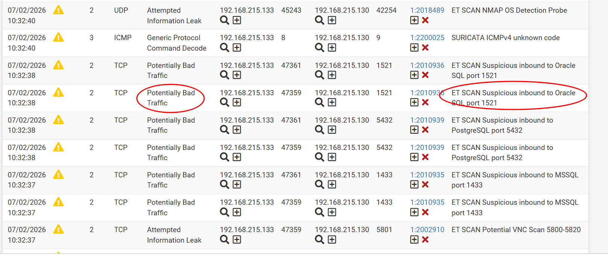

---

# Validation du fonctionnement

Une fois la configuration terminée, plusieurs scénarios d'attaque ont été exécutés depuis une machine Kali Linux afin de vérifier le bon fonctionnement du moteur de détection.

L'objectif n'était pas uniquement de générer des alertes, mais également de comprendre quelles signatures étaient déclenchées selon les différents types d'attaques.

---

# Détection d'un scan agressif Nmap

Le premier scénario consiste à lancer un scan agressif avec Nmap contre une machine du laboratoire.

Ce type de scan combine plusieurs techniques de reconnaissance :

- découverte des hôtes ;
- détection des systèmes d'exploitation ;
- détection des versions de services ;
- exécution de scripts NSE par défaut.

Ce comportement est rapidement identifié par Suricata grâce aux signatures ET Open.

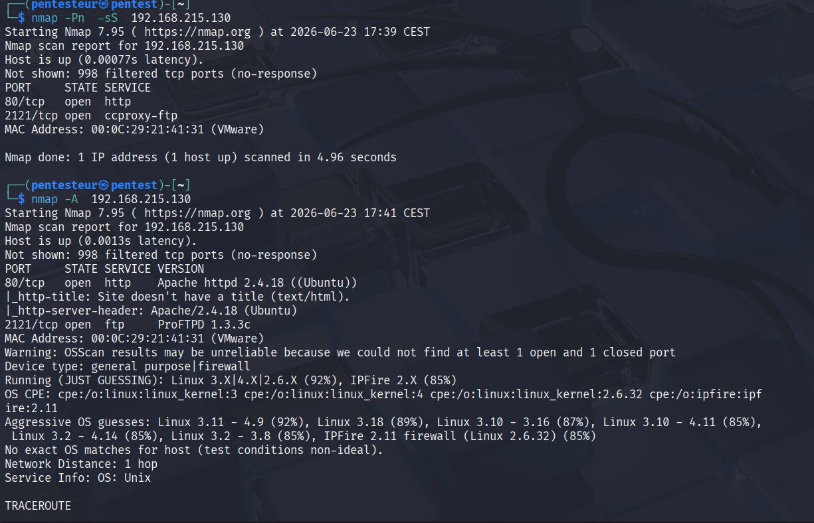

---

## Résultat obtenu

Le lancement du scan provoque immédiatement la génération d'alertes dans Suricata.

Les signatures déclenchées démontrent que le moteur IDS est capable d'identifier une activité de reconnaissance avant même qu'une tentative d'exploitation ne soit réalisée.

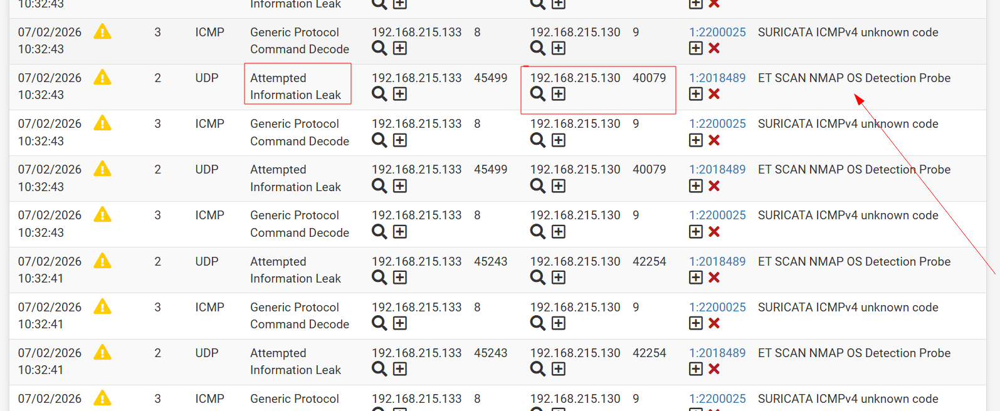

---

# Tableau de bord

Afin de faciliter la supervision, les informations collectées par Suricata sont également visibles depuis le tableau de bord de pfSense.

Ce widget fournit une vue rapide sur l'état du service ainsi que sur les événements récemment détectés.

Il constitue un point de contrôle utile pour vérifier rapidement que le moteur IDS fonctionne correctement.

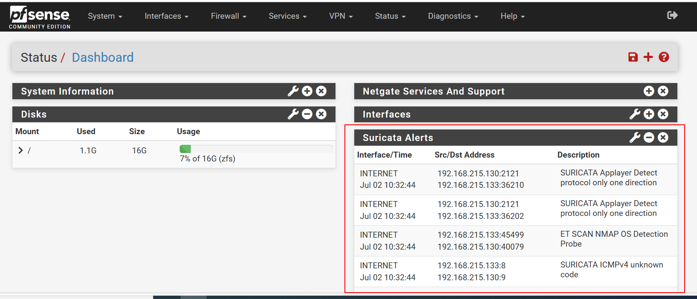

# Validation des scénarios d'attaque

Une fois Suricata configuré et les signatures activées, plusieurs scénarios d'attaque ont été réalisés depuis une machine **Kali Linux** afin de valider le bon fonctionnement du moteur IDS.

L'objectif était de reproduire des comportements fréquemment observés lors des phases de reconnaissance ou d'attaque d'une infrastructure d'entreprise.

Chaque scénario a permis de vérifier que les signatures correspondantes étaient correctement détectées et journalisées par Suricata.

---

# Scan UDP

Le premier scénario consistait à exécuter un scan UDP à l'aide de **Nmap**.

Contrairement aux scans TCP, les scans UDP permettent d'identifier les services fonctionnant sur des ports UDP tels que DNS, DHCP ou SNMP. Ce type de reconnaissance est fréquemment utilisé avant une tentative d'exploitation.

Suricata a correctement identifié cette activité et généré les alertes correspondantes.

---

# Scan complet des ports

Un second scénario consistait à effectuer un scan de l'ensemble des ports TCP de la machine cible.

Ce type de scan est généralement utilisé afin d'obtenir une cartographie complète des services accessibles avant une phase d'exploitation.

Le trafic généré a immédiatement été détecté par Suricata grâce aux signatures dédiées aux activités de reconnaissance.

---

# Scan avec les scripts NSE

Les scripts **Nmap Scripting Engine (NSE)** permettent d'automatiser des opérations avancées telles que :

- l'énumération de services ;
- la détection de vulnérabilités ;
- la collecte d'informations complémentaires.

Ce scénario reproduit une phase avancée de reconnaissance généralement observée avant une tentative d'intrusion.

Suricata a détecté cette activité et enregistré les événements associés.

---

# Test FTP

Afin de valider la détection des protocoles applicatifs, une connexion FTP a été réalisée vers un serveur présent dans la DMZ.

Ce scénario permet de vérifier que Suricata inspecte correctement les échanges applicatifs et applique les signatures spécifiques au protocole FTP.

Les événements générés apparaissent immédiatement dans le journal des alertes.

---

# Simulation d'une attaque par force brute FTP

Une attaque par force brute a ensuite été simulée à l'aide de **Hydra**.

L'objectif était de reproduire une tentative d'authentification répétée contre le service FTP hébergé dans la DMZ.

Cette activité est représentative d'un scénario réel dans lequel un attaquant tente d'obtenir un accès non autorisé à l'aide d'un dictionnaire de mots de passe.

Suricata a correctement identifié ce comportement et généré les alertes correspondantes.

---

# Détection des requêtes ICMP

Des requêtes **ICMP Echo Request (Ping)** ont également été envoyées depuis Kali Linux.

Même si ce type de trafic est légitime dans certains contextes, il est fréquemment utilisé durant les phases de découverte d'un réseau.

Les signatures activées permettent de journaliser ces événements afin de fournir une visibilité complète sur les activités de reconnaissance.

---

# Analyse des alertes

L'ensemble des scénarios exécutés durant cette phase a généré des alertes visibles dans l'interface de Suricata.

Chaque alerte fournit des informations essentielles pour l'analyse d'un incident :

- date et heure de l'événement ;
- adresse IP source ;
- adresse IP destination ;
- protocole utilisé ;
- priorité de la règle ;
- catégorie de l'événement ;
- identifiant GID/SID ;
- description de la signature déclenchée.

Ces informations permettent d'identifier rapidement la nature d'une attaque et de faciliter les investigations de sécurité.

---

# Résultats obtenus

Les différents scénarios réalisés démontrent que Suricata détecte efficacement les activités de reconnaissance et plusieurs comportements malveillants couramment observés lors des premières phases d'une cyberattaque.

Les tests ayant déclenché des alertes sont notamment :

- Scan agressif Nmap ;
- Scan UDP ;
- Scan complet des ports ;
- Scan avec les scripts NSE ;
- Connexion FTP ;
- Tentative de force brute FTP avec Hydra ;
- Requêtes ICMP.

Ces validations confirment le bon fonctionnement du moteur IDS ainsi que la pertinence des signatures **Emerging Threats Open** utilisées dans le laboratoire.

# Expérimentation du mode IPS

Au-delà de la simple détection d'intrusion, une phase d'expérimentation a été réalisée afin d'évaluer les capacités de prévention offertes par Suricata.

L'objectif était de vérifier si le moteur pouvait non seulement détecter les activités malveillantes, mais également empêcher automatiquement leur exécution en bloquant les communications des hôtes considérés comme suspects.

Cette étape constitue une évolution naturelle d'un système IDS vers un véritable système IPS.

---

# Passage en mode Inline

Dans un premier temps, Suricata a été configuré en **mode Inline**.

Ce mode permet au moteur d'inspecter les paquets directement lors de leur transit et de les bloquer avant qu'ils n'atteignent leur destination lorsqu'une règle de type **DROP** est déclenchée.

La configuration a été réalisée sur les interfaces protégées afin de reproduire le fonctionnement d'un IPS déployé en environnement de production.

---

# Analyse des résultats

Les premiers essais ont confirmé le bon fonctionnement du moteur de détection.

Les différentes attaques continuaient à être détectées correctement.

En revanche, les mécanismes de blocage en mode Inline n'ont pas produit les résultats attendus dans l'environnement de virtualisation utilisé.

Après plusieurs analyses et différentes phases de test, il est apparu que cette limitation était principalement liée aux contraintes de l'environnement de laboratoire et de la virtualisation, plutôt qu'à une mauvaise configuration de Suricata.

Cette phase a néanmoins permis de mieux comprendre le fonctionnement interne du moteur IPS ainsi que les différences entre les modes Inline et Legacy.

---

# Choix du mode Legacy

Afin de disposer d'une plateforme stable et parfaitement fonctionnelle pour la suite du laboratoire, le choix a été fait de revenir en **mode Legacy**.

Ce mode reste largement utilisé dans les laboratoires de sécurité et permet de démontrer efficacement les mécanismes de détection ainsi que le blocage automatique des adresses IP malveillantes.

Ce choix garantit également une meilleure reproductibilité des scénarios d'attaque réalisés dans le cadre de cette infrastructure.

---

# Validation du blocage automatique

Une fois le mode Legacy activé, plusieurs attaques ont été relancées depuis la machine Kali Linux.

Suricata a correctement identifié les comportements malveillants et ajouté automatiquement les adresses IP concernées dans la liste des hôtes bloqués.

Cette fonctionnalité démontre la capacité du moteur à limiter certaines activités malveillantes sans intervention manuelle de l'administrateur.

---

# Gestion des signatures (SID Management)

Afin de mieux comprendre le fonctionnement des règles Suricata, une phase d'expérimentation a également été réalisée sur le système de gestion des signatures (**SID Management**).

Cette étape a permis d'étudier :

- l'activation des catégories de règles ;
- la modification du comportement des signatures ;
- les mécanismes de transformation des règles d'alerte en règles de blocage ;
- la personnalisation des politiques de détection.

Cette expérimentation constitue une première approche de l'administration avancée de Suricata.

---

# Compétences acquises

La réalisation de cette partie du laboratoire a permis de développer plusieurs compétences techniques :

- installation et administration de Suricata sur pfSense ;
- compréhension du fonctionnement d'un IDS et d'un IPS ;
- configuration des interfaces de surveillance ;
- gestion des signatures Emerging Threats Open ;
- analyse des alertes de sécurité ;
- interprétation des signatures réseau ;
- réalisation de scénarios d'attaque avec Kali Linux ;
- analyse des limites d'une architecture virtualisée ;
- validation du blocage automatique des adresses IP en mode Legacy.

Au-delà de la configuration, cette phase a permis de mieux comprendre le cycle complet de détection d'une attaque, depuis la génération du trafic malveillant jusqu'à son identification et son traitement par le moteur IDS/IPS.

---

# Conclusion

L'intégration de Suricata apporte une couche de sécurité supplémentaire à l'infrastructure SecureTech en permettant une inspection approfondie du trafic réseau.

Les différents scénarios réalisés ont démontré la capacité du moteur à détecter des activités de reconnaissance et plusieurs comportements malveillants couramment observés lors des premières phases d'une cyberattaque.

Cette expérimentation a également permis d'évaluer le fonctionnement du mode IPS Inline avant de retenir le mode Legacy comme configuration finale, choix motivé par les contraintes de l'environnement de virtualisation et la stabilité recherchée pour le laboratoire.

Au-delà de la mise en œuvre technique, cette partie du projet a permis d'acquérir une compréhension approfondie du fonctionnement d'un IDS/IPS, de la gestion des signatures de détection et des mécanismes de prévention utilisés dans les infrastructures d'entreprise modernes.

Les travaux futurs porteront notamment sur l'enrichissement des politiques de détection, la création de règles personnalisées, l'intégration avec les outils de supervision et la mise en place de scénarios d'attaque plus avancés afin de renforcer encore les capacités de détection et de réponse du laboratoire.
